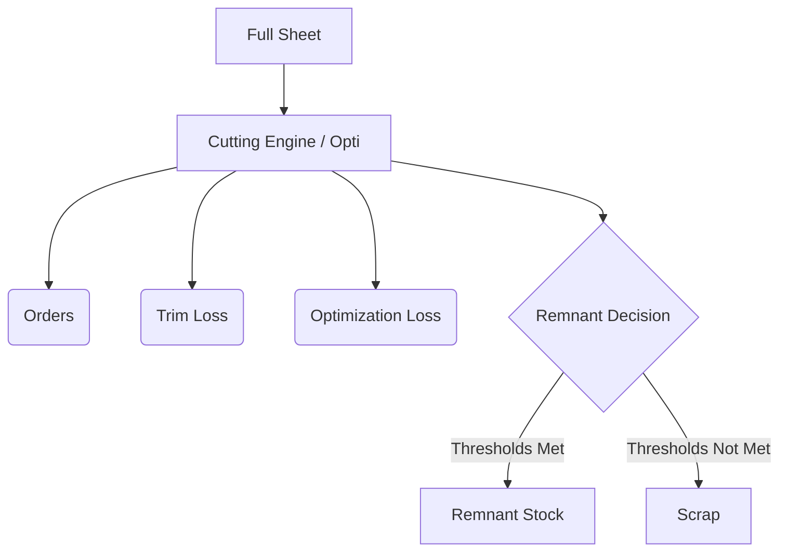

# PRODUCTION_CALCULATION_ENGINE — GlassOS Üretim Hesaplama Motoru

> **Sürüm:** 1.0
> **Tarih:** 15 Temmuz 2026
> **Durum:** Implemented (Sprint 2.2) — Mimarisi Dondurulmuş Referans Dokümandır.
> **Yazar:** Architecture Refactoring — Sprint 2.2 Sonrası
> **Bağımlı Dokümanlar:** `PRODUCTION_ARCHITECTURE.md`, `PRODUCT_ARCHITECTURE.md`, `DECISIONS.md`

---

## İçindekiler

1. [Production Philosophy](#1-production-philosophy)
2. [Business Dimension](#2-business-dimension)
3. [Production Dimension](#3-production-dimension)
4. [Cutting Dimension](#4-cutting-dimension)
5. [Grinding Engine](#5-grinding-engine)
6. [Trim Engine](#6-trim-engine)
7. [Factory Configuration](#7-factory-configuration)
8. [Full Sheet Consumption](#8-full-sheet-consumption)
9. [Optimization Engine](#9-optimization-engine)
10. [Waste Classification](#10-waste-classification)
11. [Remnant Classification](#11-remnant-classification)
12. [Scrap Classification](#12-scrap-classification)
13. [Cost Calculation Engine](#13-cost-calculation-engine)
14. [Yield Calculation](#14-yield-calculation)
15. [Production Efficiency](#15-production-efficiency)
16. [Inventory Consumption](#16-inventory-consumption)
17. [Examples](#17-examples)
18. [Inventory Valuation Engine](#18-inventory-valuation-engine)
19. [Advanced Yield & Cutting Result Architecture](#19-advanced-yield--cutting-result-architecture)
20. [Future Extensions](#20-future-extensions)

---

## Sprint 2.3.10 — Cutting Execution Layer

Bu sprintte üretim hesaplama motorunun yanında bir operasyonel akış katmanı eklendi. `CuttingExecutionEngine`, kesim operatörünün günlük üretimini sistemde hızla işleyebilmesi için batch lifecycle, sipariş ekleme/çıkarma, used sheet count, kesim başlatma/bitirme ve mevcut `BatchCuttingEngine` / `ProductionCalculationService` üzerinden execution summary üretimini destekler.

## Sprint 2.3.11 — Production Queue Layer

İş akışı sipariş bazlı tamamlanma yerine operasyon bazlı ilerleme modeline geçirildi. `ProductionQueueEngine`, bir sipariş satırının farklı operasyonlar üzerinden kuyruğa alınmasını, bir operasyon tamamlandığında sonraki operasyon kuyruğuna taşınmasını ve satır/ sipariş ilerleme yüzdesinin hesaplanmasını sağlar.

---

Bu sprintte üretim hesaplama motorunun yanında bir operasyonel akış katmanı eklendi. `CuttingExecutionEngine`, kesim operatörünün günlük üretimini sistemde hızla işleyebilmesi için batch lifecycle, sipariş ekleme/çıkarma, used sheet count, kesim başlatma/bitirme ve mevcut `BatchCuttingEngine` / `ProductionCalculationService` üzerinden execution summary üretimini destekler.

Bu katmanın amacı, kesim işleminin mantıksal akışını modellemek; nesting, sheet allocation, makine optimizasyonu veya stok tüketimi gibi alanlara dokunmamaktır.

---

## 1. Production Philosophy

GlassOS hesaplama motoru üç temel felsefeye dayanır. Bu motor, üretim takibini sipariş kalemi ve sayaçlar üzerinden yürütür; fiziksel cam parçaları kalıcı veri varlığı olarak modellenmez.

### 1.1. Gerçek Maliyet Görünürlüğü

Cam sektöründe geleneksel maliyet hesaplamaları **hatalıdır** çünkü:

- Trim, Grinding ve Optimization kayıpları tek bir "fire payı" olarak toplulanır.
- Her kayıp türü farklı ölçüde, farklı aşamada ve farklı hesaplama mantığıyla ortaya çıkar.
- "m² başına sabit maliyet" yanlış bir modeldir; çevre bazlı tüketimler (çıta, silikon) aynı alana sahip farklı şekillerde tamamen farklıdır.

GlassOS bu problemi **katmanlı hesaplama motoru** ile çözer: Her kayıp türü kendi motor modülünde ayrı hesaplanır ve raporlanır.

### 1.2. İki Boyut İlkesi

GlassOS, sistemin farklı katmanlarında **iki ayrı boyut** kullanır:

| Boyut                    | Tanım                                    | Nerede Kullanılır                             |
| ------------------------ | ---------------------------------------- | --------------------------------------------- |
| **Business Dimension**   | Müşterinin sipariş ettiği ölçü           | Her yerde — ofis, saha, etiket, müşteri       |
| **Production Dimension** | Cutting Engine için hesaplanan brüt ölçü | Yalnızca Cutting Engine ve Cost Engine içinde |

Bu iki boyut **asla karıştırılmaz.** Sistem her zaman müşteri ölçüsünü referans olarak saklar; üretim ölçüsü sadece hesaplama amacıyla türetilir.

### 1.3. Factory-First Konfigürasyon

Sistem sektör geneline uygulanamaz tek bir sabit formül kullanmaz.

- Trim değerleri fabrikadan fabrikaya değişir.
- Grinding değerleri makineye ve cam tipine göre değişir.
- Remnant eşikleri fabrikanın stok politikasına bağlıdır.

Bu nedenle hesaplama motorunun tüm parametreleri **Factory Configuration** üzerinden yönetilir.

---

## 2. Business Dimension

### 2.1. Tanım

Business Dimension, **müşterinin talep ettiği nihai ölçüdür.**

```
Müşteri Siparişi: 500 mm x 2000 mm
Bu ölçü Business Dimension'dır.
```

### 2.2. Kullanım Alanları

Business Dimension aşağıdaki tüm süreçlerde kullanılır:

| Süreç           | Açıklama                                                    |
| --------------- | ----------------------------------------------------------- |
| Sipariş Girişi  | Ofiste müşteri ölçüsü girilir, sistemde saklanır            |
| Üretim Takip    | İstasyon ekranlarında görüntülenen ölçü                     |
| Temper / Isıcam | İstasyon operatörlerinin gördüğü ölçü                       |
| Kalite Kontrol  | Ölçüm sonuçları Business Dimension üzerinden kontrol edilir |
| Depo            | Ürün etiketindeki ölçü                                      |
| Sevkiyat        | İrsaliye ve teslimat belgelerindeki ölçü                    |
| Müşteri Portalı | Müşterinin göreceği ölçü                                    |
| Raporlar        | Tüm raporlarda görünen ölçü                                 |
| Etiketler       | Barkod etiketindeki ölçü                                    |

### 2.3. Değişmezlik Kuralı

> **KURAL:** Business Dimension sisteme girdikten sonra hiçbir aşamada değiştirilmez, genişletilmez veya başka bir değerle ikame edilmez.
>
> Operatör dahil sistemin her katmanı müşteri ölçüsünü görür. Rodaj eklenmiş ölçü hiçbir yerde görünmez.
>
> **Not:** Üretim rotası ve operasyon sıralaması için `PRODUCTION_FLOW_ARCHITECTURE.md` referans alınmalıdır.

---

## 3. Production Dimension

### 3.1. Tanım

Production Dimension, **Business Dimension'dan türetilen, sadece hesaplama motorları tarafından kullanılan dahili ölçüdür.**

```
Production Dimension = Business Dimension + Grinding Allowance

Örnek:
  Business Dimension:  500 x 2000
  Grinding (her kenar): Left=1, Right=1, Top=1, Bottom=1
  Production Dimension: (500+1+1) x (2000+1+1) = 502 x 2002
```

### 3.2. Kullanım Kısıtı

Production Dimension yalnızca şu iki motorun iç hesaplamalarında kullanılır:

1. **Cutting Engine** — Kesim planı ve hammadde tüketimi hesabı
2. **Cost Engine** — Brüt malzeme maliyeti hesabı

Production Dimension hiçbir zaman:

- Saha operatörüne gösterilmez
- Etiket veya irsaliyeye yazılmaz
- Müşteri ekranında görünmez
- Raporlarda Business Dimension'ın yerine geçmez

---

## 4. Cutting Dimension

### 4.1. Tanım

Cutting Dimension, Cutting Engine'in **kesim planı oluştururken kullandığı brüt boyuttur.**

```
Cutting Dimension = Production Dimension
```

Kesim operatörü Business Dimension'ı görür. Makineye girilecek gerçek kesim boyutu Cutting Engine tarafından arka planda hesaplanmış Production Dimension'dır. Operatör bu hesabı görmez; sistem otomatik uygular.

### 4.2. Nesting ve Yerleşim

Optimizasyon motoru, Full Sheet üzerine parçaları yerleştirirken Production Dimension'ı kullanır. Bu sayede:

- Her parça için rodaj payı önceden hesaplanmış olur
- Parçalar arasında yeterli boşluk garantilenir
- Gerçekçi fire hesabı yapılabilir

---

## 5. Grinding Engine

### 5.1. Tanım

Grinding (Rodaj) Engine, cam kenarlarındaki işlem payını hesaplayan motordur.

Rodaj, ürünün son ölçüsüne ulaşmak için cam kenarlarından belirli bir miktarın alınması işlemidir. Bu işlem sırasında tüketilen pay brüt üretim ölçüsüne önceden eklenerek Production Dimension oluşturulur.

### 5.2. Kenar Bağımsız Tanım

Grinding payı **tek bir toplam değer olarak değil, her kenar için ayrı ayrı** tanımlanır:

```
Grinding Configuration:
  Left   = X mm
  Right  = X mm
  Top    = Y mm
  Bottom = Y mm
```

Bu yaklaşımın gerekçesi:

- Bazı cam türlerinde yalnızca belirli kenarlar işleme alınır.
- Makine konfigürasyonuna göre sol/sağ ve üst/alt paylar farklılık gösterebilir.
- Toplam X veya Y değeri hesaplama aşamasında bu bağımsız değerlerden türetilir; kayıt bu şekilde yapılmaz.

### 5.3. Hesaplama Formülü

```
Cutting Width  = Business Width  + Grinding.Left + Grinding.Right
Cutting Height = Business Height + Grinding.Top  + Grinding.Bottom

Örnek:
  Business:   500 x 2000
  Left=1, Right=1, Top=2, Bottom=2
  Cutting:    (500+1+1) x (2000+2+2) = 502 x 2004
```

### 5.4. Grinding Loss

Grinding sırasında tüketilen cam alanı **Grinding Loss** olarak sınıflandırılır. Bu kayıp:

- Sipariş maliyetine hammadde tüketimi olarak eklenir
- Fire raporlarında ayrı gösterilir
- Müşteriye yansıtılmaz; fabrika maliyetidir

---

## 6. Trim Engine

### 6.1. Tanım

Trim Engine, **Full Sheet üzerindeki kullanılamayan kenar paylarını hesaplayan motordur.**

Trim, bireysel bir cama uygulanmaz. Trim, float cam plakasının dış kenarlarından alınan zorunlu kayıptır.

### 6.2. Trim vs Grinding — Temel Fark

Bu iki kavram sıkça karıştırılır; aralarındaki fark kritiktir:

| Özellik                        | Trim                              | Grinding                      |
| ------------------------------ | --------------------------------- | ----------------------------- |
| Ne üzerine uygulanır           | Full Sheet (Plaka)                | Bireysel cam (sipariş kalemi) |
| Ne zaman uygulanır             | Stok/Envanter girişinde           | Üretim hesabında              |
| Etkisi nerede görünür          | Kullanılabilir plaka alanı azalır | Production Dimension büyür    |
| Sipariş ölçüsünü değiştirir mi | Hayır                             | Hayır                         |
| Üretim ölçüsünü değiştirir mi  | Hayır                             | Evet (Production Dimension)   |
| Maliyet etkisi                 | Inventory / Optimization hesabı   | Cost Engine hammadde hesabı   |

### 6.3. Kenar Bağımsız Tanım

Trim de Grinding gibi **her kenar için ayrı ayrı** tanımlanır:

```
Trim Configuration:
  Left   = A mm
  Right  = B mm
  Top    = C mm
  Bottom = D mm
```

Esnek kenar desteği:

- Bazı fabrikalar 4 kenar trim uygular
- Bazıları yalnızca 2 kenar (sol/sağ)
- Bazıları 3 kenar uygular
- Sistem tüm kombinasyonları destekler; tanımlanmayan kenar için değer `0` kabul edilir

### 6.4. Trim'in Etkisi

```
Full Sheet Nominal: 6000 x 3210
Trim Configuration: Left=20, Right=20, Top=15, Bottom=15

Kullanılabilir Alan:
  Usable Width  = 6000 - 20 - 20 = 5960 mm
  Usable Height = 3210 - 15 - 15 = 3180 mm
  Usable Area   = 5960 x 3180 = 18,952,800 mm2 ≈ 18.95 m2
```

Optimizasyon motoru bu küçülen alan üzerinde çalışır. Nominal plaka alanı üzerinde değil.

### 6.5. Trim Loss

Trim kayıpları **Trim Loss** olarak sınıflandırılır:

- Trim Loss, stok tüketimi hesaplamalarına dahil edilir
- Sipariş maliyetine orantısal olarak dağıtılır
- Müşteri ölçüsünü veya üretim ölçüsünü etkilemez

---

## 7. Factory Configuration

### 7.1. Tanım

Factory Configuration, hesaplama motorunun fabrikaya özgü parametrelerinin saklandığı merkezi yapıdır.

GlassOS veri katmanında bu model, her fabrika için `settings.factory_configuration` JSONB alanı olarak tutulur. Bu yapı versioned ve gruplandırılmıştır; karmaşık fabrika kuralları `trimConfiguration`, `grindingConfiguration`, `remnantConfiguration`, `inventoryConfiguration`, `kerfConfiguration` ve `toleranceMatching` bölümlerinde saklanır. Bu sayede tüm üretim motorları aynı fabrika düzeyindeki temel parametre kümesine erişebilir.

Bu sprintte `ProductionCalculationService` eklendi. Servis, Factory Configuration'dan alınan grinding ayarlarına göre üretim ölçülerini, alan hesaplarını ve tüketim alanını hesaplar. Henüz trim, optimizasyon veya layout hesaplaması yapılmaz.

Her fabrika aşağıdaki parametre gruplarını kendi iş kurallarına göre ayarlar. Bu ayarlar kiracıya (tenant) özel ve fabrikaya bağlıdır.

### 7.2. Grinding Configuration

Bu değerler `settings.factory_configuration.grindingConfiguration` altında saklanır.

```
grindingConfiguration: {
  enabled: boolean,
  strategy: "PER_EDGE" | "AXIS" | "CUSTOM",
  leftMm: decimal,
  rightMm: decimal,
  topMm: decimal,
  bottomMm: decimal,
}
```

Örnek: { left: 1.0, right: 1.0, top: 2.0, bottom: 2.0 }

Bu değerler ürün tipine veya makineye göre farklılaştırılabilir (Bkz. Bölüm 18 — Future Extensions).

### 7.3. Trim Configuration

Bu değerler `settings.factory_configuration.trimConfiguration` altında saklanır.

```
trimConfiguration: {
  enabled: boolean,
  strategy: "PER_EDGE" | "AXIS" | "CUSTOM",
  leftMm: decimal,
  rightMm: decimal,
  topMm: decimal,
  bottomMm: decimal,
}
```

Örnek (4 kenar): { left: 20, right: 20, top: 15, bottom: 15 }
Örnek (2 kenar): { left: 0, right: 0, top: 15, bottom: 15 }

### 7.4. Remnant Configuration

Bu değerler `settings.factory_configuration.remnantConfiguration` altında saklanır.

```
remnantConfiguration: {
  enabled: boolean,
  minimumWidthMm: decimal,
  minimumHeightMm: decimal,
  minimumAreaMm2: decimal,
}
```

Örnek: { minimumWidthMm: 200, minimumHeightMm: 200, minimumAreaMm2: 60000 }
-- 200x200 mm ve 600 cm2 üzeri → Remnant
-- Altındakiler → Scrap

### 7.5. Tolerance Configuration (Dead Stock Eşleştirme)

```
tolerance_width_mm    : decimal  -- Dead Stock eşleştirme toleransı (en)
tolerance_height_mm   : decimal  -- Dead Stock eşleştirme toleransı (boy)

Örnek: { width: 10, height: 10 }
-- Sipariş: 500x2000 → Havuzda 495x1995 de eşleşir
```

---

## 8. Full Sheet Consumption

### 8.1. Tanım

Full Sheet Consumption, bir üretim partisi için kaç adet tam plaka (Full Sheet) kullanılacağını yöneten modeldir.

### 8.2. Operatör Bildirimi

Sistem, teorik olarak optimizasyon motoru çıktısına göre plaka sayısını hesaplayabilir. Ancak gerçekte:

- Kırıklar olabilir
- Makinenin fiziksel kısıtları optimizasyon planıyla tam örtüşmeyebilir
- Operatör sahada fiili durumu en iyi bilendir

Bu nedenle **Full Sheet tüketimini kesim operatörü sisteme bildirir.** Operatör kesim tamamlandıktan sonra "Kaç plaka kullandım?" sorusuna yanıt girer.

### 8.3. Bildirimin Önemi

Operatörün bildirdiği plaka sayısı tüm gerçek hesapların temel girdisidir:

```
Kullanılan Plaka Sayısı (n) → Maliyet Motoru'na girer
                            → Waste Motoru'na girer
                            → Inventory Tüketim Motoru'na girer
```

### 8.4. Teorik vs. Gerçek

| Hesap          | Tanım                                             |
| -------------- | ------------------------------------------------- |
| Teorik Tüketim | Optimizasyon çıktısına göre beklenen plaka sayısı |
| Gerçek Tüketim | Operatörün bildirdiği fiili plaka sayısı          |
| Sapma          | Gerçek - Teorik = Production Loss göstergesi      |

---

## 9. Optimization Engine

### 9.1. Tanım

Optimization Engine, sipariş kalemlerindeki camları Full Sheet üzerine en verimli şekilde yerleştiren (nesting) hesaplama motorudur.

### 9.2. Girdi Parametreleri

```
Inputs:
  - Full Sheet Usable Area    (Trim sonrası hesaplanmış)
  - Production Dimensions     (her cam için Cutting Dimensions listesi)
  - Cam türü kısıtları        (farklı cam türleri aynı plakada kesilmez)
  - Rotasyon izni             (cam döndürülebilir mi?)
  - Kerf                      (testerenin kayba neden olduğu mm genişliği)
```

### 9.3. Optimization Loss

Nesting algoritması mükemmel verimlilik elde edemez; kalan boşluklar **Optimization Loss** olarak sınıflandırılır:

```
Optimization Loss = Usable Area - Sum(Production Dimensions) - Remnant Alanı - Scrap Alanı
```

Bu kayıp raporlarda ayrı gösterilir; Trim Loss veya Grinding Loss ile karıştırılmaz.

### 9.4. Dış Entegrasyon Notu

GlassOS, üçüncü taraf optimizasyon yazılımlarıyla (Opti, Glass Expert vb.) entegrasyonu destekleyecek biçimde tasarlanmıştır. Bu durumda optimizasyon çıktısı (kesim planı) dışarıdan alınır ve GlassOS bu planı üretim takibi, maliyet ve fire hesabı için kullanır. Bkz. Bölüm 18.

---

## 10. Waste Classification

GlassOS, "fire" kavramını tek bir kalem olarak değil ayrı sınıflara bölerek yönetir. Her sınıf farklı hesaplama mantığına, farklı raporlama görünümüne ve farklı aksiyon planına sahiptir.

| Sınıf                 | Kaynak                             | Hesaplama Birimi | Raporlama                |
| --------------------- | ---------------------------------- | ---------------- | ------------------------ |
| **Trim Loss**         | Full Sheet kenar payları           | mm2 / m2         | Stok ve maliyet raporu   |
| **Grinding Loss**     | Rodaj payı tüketimi                | mm2 / m2         | Ürün maliyet raporu      |
| **Optimization Loss** | Nesting verimsizliği               | mm2 / m2         | Kesim verimliliği raporu |
| **Scrap Loss**        | Kesilemez küçük artıklar           | mm2 / m2 ve kg   | Hurda raporu             |
| **Production Loss**   | Fiili vs. teorik plaka farkı       | Plaka adedi / m2 | OEE raporu               |
| **Quality Loss**      | Kalite kontrolden geçemeyen ürün   | Adet / m2        | Kalite raporu            |
| **Breakage Loss**     | Kırık cam                          | Adet / m2        | Fire ve Remake raporu    |
| **Inventory Loss**    | Stok düşümü farklılıkları          | m2               | Envanter raporu          |
| **Remnant**           | Yeniden kullanılabilir kalan parça | mm2 / m2         | Dead Stock havuzu        |

---

## 11. Remnant Classification

### 11.1. Tanım

Remnant, kesim sonunda Full Sheet'ten arta kalan parçaların **yeniden kullanılabilir olanıdır.**

Tüm kesim artıkları hurda (Scrap) değildir. Fabrika, ilerleyen siparişlerde bu parçaları değerlendirebilir.

### 11.2. Remnant Kararı

Bir parçanın Remnant mi yoksa Scrap mı olduğuna **sistem karar verir.** Karar kriteri Factory Configuration'daki eşiklerdir:

```
Karar Mantığı:
  IF parça.genişlik  >= remnant_min_width_mm
 AND parça.yükseklik >= remnant_min_height_mm
 AND parça.alan      >= remnant_min_area_mm2
  THEN → Remnant  (Dead Stock Havuzuna Gönder)
  ELSE → Scrap    (Hurda)
```

### 11.3. Remnant Yaşam Döngüsü

```
Kesim Tamamlandı
      ↓
Parça boyutları hesaplandı
      ↓
Remnant mı? ──Hayır──→ Scrap (kg ile tartılır, hurda raporu)
      ↓ Evet
Dead Stock Havuzuna Eklenir
      ↓
Yeni Sipariş Girildi
      ↓
Toleranslı Eşleştirme: (en ± tolerance_width) AND (boy ± tolerance_height)
      ↓
Eşleşme Bulundu ──→ Ofis'e Uyarı: "Bu camı havuzdan kullanabilirsiniz"
      ↓
Kullanıldı ──→ Havuzdan Çıkar  (Inventory Loss = 0, fire kurtarıldı)
```

### 11.4. Değer Etkisi

Remnant Dead Stock havuzuna girdiğinde:

- Stok kayıt değerinde tutulur (maliyet hemen düşmez)
- Kullanıldığında hammadde maliyeti sıfırlanır (fire kurtarımı)
- Kullanılmazsa belirli süre sonra Scrap'a dönüştürülebilir

---

## 12. Scrap Classification

### 12.1. Tanım

Scrap, kesim artıklarından Remnant eşiklerini karşılamayan, artık üretimde kullanılamayacak küçük parçalardır.

### 12.2. Scrap Hesabı

```
Scrap Alanı = Usable Area - Sum(Production Dims) - Optimization Loss - Remnant Alanı

Scrap Ağırlığı = Scrap Alanı (m2) × Cam Kalınlığı (mm) × Cam Yoğunluğu (kg/m3)
```

Ağırlık hesabı kritiktir çünkü hurda satışları **m2 üzerinden değil kg üzerinden** yapılır.

### 12.3. Scrap Ekonomisi

- Scrap fiziksel olarak ayrılır ve tartılır
- Hurda fiyatı (kg başına) Factory Configuration'da tanımlanır
- Scrap değeri maliyet raporunda "fire kurtarım geliri" olarak eksi maliyet gösterilir

---

## 13. Cost Calculation Engine

### 13.1. Katmanlı Maliyet Modeli

GlassOS maliyeti tek bir formülle değil katmanlı ve ayrıştırılmış bir modelle hesaplar:

```
Toplam Sipariş Maliyeti =
    Hammadde Maliyeti              (Production Dimension bazlı)
  + Trim Loss Payı                 (orantısal dağıtım)
  + Grinding Loss Maliyeti         (Grinding Allowance × birim fiyat)
  + Optimization Loss Maliyeti     (nesting verimsizliği payı)
  + İşlem Bazlı Maliyetler         (Temper, delik, CNC vb.)
  + Çevre Bazlı Maliyetler         (Isıcam için spacer, silikon)
  + Sabit Gider Payı               (aylık giderler / aylık toplam m2)
  + Ardiye Maliyeti                (bekleme süresi × günlük birim)
  - Scrap Geliri                   (hurda kg × hurda fiyatı)
  - Remnant Kurtarım Değeri        (Dead Stock'tan kullanılırsa)
```

### 13.2. Hammadde Maliyeti

Hammadde maliyeti **Production Dimension** üzerinden hesaplanır (Business Dimension değil):

```
Hammadde Maliyeti =
    Production Width (mm)
  × Production Height (mm)
  × Cam Kalınlığı (mm)
  × Cam Yoğunluğu (kg/m3)
  × Birim Fiyat (TL/kg veya TL/m2)
```

### 13.3. Çevre Bazlı Maliyetler (Isıcam İçin Kritik)

Isıcam ve lamine ürünlerde spacer, silikon ve butil çevre üzerinden tüketilir:

```
Çevre = 2 × (Business Width + Business Height)   [mm cinsinden]

Spacer Maliyeti  = Çevre × Spacer Birim Fiyat (TL/metre)
Silikon Maliyeti = Çevre × Cam Kalınlığı × Silikon Tüketim Katsayısı
```

Bu hesap **Business Dimension** üzerinden yapılır. Müşterinin sipariş ettiği alanda ne kadar çevre malzemesi kullanıldığı önemlidir; üretim payı bu hesaba eklenmez.

### 13.4. Sabit Gider Payı

```
Aylık Sabit Giderler = Elektrik + Doğalgaz + İşçilik + Amortisman
Aylık Toplam Üretim  = X m2

Sabit Gider Payı (m2 başına)  = Aylık Sabit Giderler / Aylık Toplam Üretim
Sipariş Sabit Gider Payı      = Sipariş m2 × Sabit Gider Payı
```

### 13.5. Trim Loss Maliyet Dağıtımı

```
Trim Loss Alanı (plaka başına) = Nominal Sheet Area - Usable Sheet Area

Trim Loss Maliyeti (plaka başına) = Trim Loss Alanı × Hammadde Birim Maliyeti

Sipariş'e Dağıtılan Trim Payı =
    Trim Loss Maliyeti × (Sipariş Production Alanı / Toplam Kesilen Production Alanı)
```

---

## 14. Yield Calculation

### 14.1. Teorik Yield (Planlanan Verimlilik)

```
Teorik Yield = Sum(Business Dimensions Area) / Usable Sheet Area × 100%

Örnek:
  Business Dimensions toplamı: 15.2 m2
  Usable Sheet Area (trim sonrası): 18.95 m2
  Teorik Yield = 15.2 / 18.95 = %80.2
```

### 14.2. Gerçek Yield (Fiili Verimlilik)

```
Gerçek Yield = Sum(Business Dimensions Area) / (Kullanılan Plaka × Nominal Sheet Area) × 100%

Örnek:
  Business Dimensions toplamı: 15.2 m2
  2 plaka kullanıldı, nominal: 19.26 m2 (6000×3210)
  Gerçek Yield = 15.2 / 38.52 = %39.5
```

### 14.3. Yield Sapması

```
Yield Sapması = Gerçek Yield - Teorik Yield

Negatif sapma → Teorik planlamadan daha fazla kayıp oluştu
Pozitif sapma → Teorik planlamadan daha verimli üretim (nadir)
```

---

## 15. Production Efficiency

### 15.1. OEE Bileşenleri

GlassOS, Overall Equipment Effectiveness (OEE) hesabını üç bileşen üzerinden yapar:

| Bileşen      | Formül                             | Açıklama                      |
| ------------ | ---------------------------------- | ----------------------------- |
| Availability | Gerçek Çalışma / Planlanan Çalışma | Makine arıza ve mola süreleri |
| Performance  | Gerçek Çıktı / Teorik Max Çıktı    | Hız ve kapasite kullanımı     |
| Quality      | Kabul Edilen / Toplam Üretilen     | Kalite redlerini çıkar        |

```
OEE = Availability × Performance × Quality
```

### 15.2. Darboğaz Tespiti

Her istasyon için kuyruk yoğunluğu izlenir:

```
Kuyruk Yoğunluğu = Bekleyen İş (m2) / İstasyon Kapasitesi (m2/gün)

> 0.8  → Uyarı
> 1.0  → Darboğaz
```

---

## 16. Inventory Consumption

### 16.1. Stok Düşüm Mantığı

Hammadde stoku, üretim onaylanıp kesim başladığında düşülür. Düşüm miktarı kullanılan plaka sayısı ve nominal plaka ölçüsüne göre hesaplanır:

```
Stok Düşümü = Kullanılan Plaka Sayısı × Nominal Sheet Area × Kalınlık × Yoğunluk
```

### 16.2. Stok Mutabakatı

Teorik stok düşümü ile fiili stok sayımı arasındaki fark **Inventory Loss** olarak raporlanır:

```
Inventory Loss = Beklenen Stok - Fiili Sayım
```

Bu fark periyodik sayımlarla tespit edilir ve raporlanır.

---

## 17. Examples

### Örnek 1: Basit Temper Cam

```
Müşteri Siparişi:
  Ölçü:     500 x 2000 mm (Business Dimension)
  Kalınlık: 6 mm
  Adet:     10

Factory Configuration:
  Grinding: Left=1, Right=1, Top=2, Bottom=2
  Trim:     Left=20, Right=20, Top=15, Bottom=15
  Remnant:  min 200x200 mm, 60,000 mm2
  Full Sheet Nominal: 6000 x 3210 mm

Adım 1 — Production Dimension:
  Width  = 500 + 1 + 1 = 502 mm
  Height = 2000 + 2 + 2 = 2004 mm

Adım 2 — Usable Sheet Area:
  Usable Width  = 6000 - 20 - 20 = 5960 mm
  Usable Height = 3210 - 15 - 15 = 3180 mm
  Usable Area   = 5960 x 3180 = 18,952,800 mm2 ≈ 18.95 m2

Adım 3 — Teorik Plaka İhtiyacı:
  10 parça × (502 x 2004) = 10,060,080 mm2 ≈ 10.06 m2
  10.06 m2 < 18.95 m2 → Teorik olarak 1 plaka yeterli

Adım 4 — Operatör Bildirimi:
  Operatör: "1 plaka kullandım"

Adım 5 — Waste Ayrımı:
  Usable Area:      18.95 m2
  Production Dims:  10.06 m2
  Kalan:             8.89 m2
  → Parça boyutlarına göre Remnant / Scrap ayrımı yapılır

Adım 6 — Maliyet Katmanları:
  Hammadde:     1 plaka × 19.26 m2 nominal × yoğunluk × birim fiyat
  Grinding:     (502×2004 - 500×2000) × 10 adet × birim fiyat
  Trim Payı:    (19.26 - 18.95) m2 × birim fiyat (10 cam arasında dağıtılır)
  İşlem:        10 adet × Temper birim maliyet
  → Sipariş toplam maliyeti

Müşteriye Gösterilen Ölçü: 500 x 2000 (Business Dimension, değişmez)
```

### Örnek 2: Isıcam — Neden m2 Yetmez?

```
Sipariş A: 1000 x 1000 mm (Kare)   → Alan = 1.0 m2
Sipariş B: 500  x 2000 mm (Dikdörtgen) → Alan = 1.0 m2

Her iki sipariş de 1 m2 alana sahiptir. ANCAK:

Kare Çevresi:       2 × (1000 + 1000) = 4000 mm = 4.0 m
Dikdörtgen Çevresi: 2 × (500  + 2000) = 5000 mm = 5.0 m

Spacer Farkı:   %25 daha fazla spacer
Silikon Farkı:  Orantısal olarak fazla

→ Aynı m2 alanında FARKLI üretim maliyeti
→ Klasik "m2 başına sabit maliyet" bu farkı göremez
→ GlassOS çevre bazlı hesap yaparak gerçek maliyeti bulur
```

### Örnek 3: Remnant Kararı

```
Kesim tamamlandı. Plakada 3 artık parça kaldı.

Factory Configuration: min_width=200, min_height=200, min_area=60000

Parça A: 350 x 1500 mm (525,000 mm2)
  genişlik 350 >= 200 ✅
  yükseklik 1500 >= 200 ✅
  alan 525,000 >= 60,000 ✅
  → REMNANT → Dead Stock Havuzuna Gönder

Parça B: 100 x 800 mm (80,000 mm2)
  genişlik 100 >= 200 ❌
  → SCRAP → Tartılır, hurda raporu

Parça C: 220 x 900 mm (198,000 mm2)
  genişlik 220 >= 200 ✅
  yükseklik 900 >= 200 ✅
  alan 198,000 >= 60,000 ✅
  → REMNANT → Dead Stock Havuzuna Gönder

Sonuç:
  Parça A ve C → Dead Stock Havuzu (ileride kullanılabilir)
  Parça B → Hurda (kg tartılır, Scrap Loss raporu)
```

### Örnek 4: Trim'in İki Kenara Uygulandığı Fabrika

```
Fabrika X konfigürasyonu:
  trim_left_mm   = 0
  trim_right_mm  = 0
  trim_top_mm    = 20
  trim_bottom_mm = 20

Full Sheet: 6000 x 3210 mm

Usable Width  = 6000 - 0 - 0 = 6000 mm (tam genişlik)
Usable Height = 3210 - 20 - 20 = 3170 mm

→ Bu fabrika yalnızca üst/alt trim uygular.
→ Sistem bunu destekler; sol/sağ trim = 0 mm olarak işlenir.
```

---

## 18. Inventory Valuation Engine

Stok değerleme süreci, fiziksel üretim maliyeti hesabından ayrı bir finansal katmandır. Üretim sahasında hesaplanan tüketim maliyeti (Production Cost) ile yasal muhasebe yöntemleriyle (FIFO, Ortalama vb.) hesaplanan maliyet (Accounting Cost) birbirinden farklıdır.

**Detaylı bilgiler, maliyet katmanları, desteklenen değerleme yöntemleri ve Specific Identification (Varsayılan Öneri) mantığı için tek resmi kaynak:**  
**[INVENTORY_VALUATION_ENGINE.md](INVENTORY_VALUATION_ENGINE.md)** dokümanıdır.

---

## 19. Advanced Yield & Cutting Result Architecture

Bu bölüm Kesim (Cutting) operasyonu sonrası elde edilen fiziksel parçaların ve firelerin yönetimini detaylandırır.

### 19.1. Cutting Result Modeli ve Full Sheet Consumption

Sprint 2.3.4 kapsamında, gerçek üretim akışının veri katmanını temsil eden `CuttingSession` domain modeli eklenmiştir. Bu model, bir kesim operasyonunun session bazlı yapısını tanımlar; ancak hesaplama, optimizasyon, maliyet, stok tüketimi, remnant/scrap karar mekanizmaları bu sprintte dahil edilmemiştir.

- `CuttingSession`: Bir üretim kesim operasyonunu temsil eder; `factoryId`, `productionDate`, `operatorId`, `machineId`, `materialId`, `glassType`, `sheetSize`, `sheetCount`, toplam alan ve durum bilgilerini kapsar.
- `OrderReference`: Order modülü henüz mevcut olmadığından placeholder olarak tanımlanır; sipariş kimliği, sipariş satırı, müşteri referansı, miktar ve net/production boyutlarını taşır.
- `SheetUsage`: Bir sheet üzerinde kullanılan alan, kalan alan, trim, grinding, scrap ve remnant alanlarını temsil eder.
- `CuttingSession` ilişkileri: bir session birden fazla sheet, birden fazla order, birden fazla remnant, birden fazla scrap ve tek bir cutting result ile ilişkilendirilir.

Bu yapı ileride Cutting Engine, Production Tracking, Remnant Management ve Reporting tarafından ortak bir veri şeması olarak kullanılacaktır.

### 19.2. Remnant Decision Service

Sprint 2.3.5 kapsamında, bir kesim sonrası parça için remnant/scrap kararını veren ilk gerçek motor eklenmiştir. Bu servis, Factory Configuration içindeki `remnantConfiguration` eşiklerini kullanır.

- `enabled`: Remnant sistemi kapalıysa tüm parçalar `scrap` olarak sınıflandırılır.
- `minimumWidthMm`: Parça genişliği bu değerden küçükse kriter başarısız olur.
- `minimumHeightMm`: Parça yüksekliği bu değerden küçükse kriter başarısız olur.
- `minimumAreaMm2`: Parça alanı bu değerden küçükse kriter başarısız olur.

Tüm kriterler sağlanırsa sonuç `remnant` olur; herhangi biri eksikse `scrap` olur. Sonuç, `decision`, `reason`, `isReusable` ve `matchedRules` alanlarını içerir.

### 19.3. Scrap Decision Service

Sprint 2.3.6 kapsamında, remnant değerlendirmesini ve parça ölçülerini kullanarak scrap/keep kararını veren `ScrapDecisionService` eklenmiştir. Bu servis, remnant değerlendirmesi sonucunu açıklanabilir bir çıktı ile birleştirir.

- `decision`: `scrap` veya `keep`
- `reason`: İnsan okunabilir açıklama
- `reasonCode`: `TOO_SMALL`, `TRIM_LOSS`, `BROKEN`, `OPERATOR_REJECTED`, `REMNANT_DISABLED`, `CONFIGURATION_RULE`, `VALID_REMNANT`
- `failedRules` / `passedRules`: Hangi kuralların başarısız/başarılı olduğunu gösterir
- `explanation`: Kararın kullanıcıya anlaşılır şekilde açıklanması
- `configurationVersion`: Etkin Factory Configuration sürümü

Bu servis henüz inventory, storage, barcode, operator screen ve cost katmanlarını kullanmaz; yalnızca karar mantığı ve explainability yapısını sağlar.

### 19.4. Cutting Result Engine

Sprint 2.3.7 kapsamında, üretim hesaplaması, remnant kararı ve scrap kararı birbirine bağlayan `CuttingResultEngine` eklenmiştir. Bu motor, mevcut modeller üzerinden tek bir `CuttingResult` üretir.

- Girdi olarak `GlassSheet`, sipariş genişliği, sipariş yüksekliği ve Factory Configuration alır.
- Çıktıda `productionResult`, `glassConsumptionArea`, `remnantArea`, `scrapArea`, `statistics` ve `metadata` alanları doldurulur.
- `ProductionCalculationService` üretim boyutlarını ve alanını hesaplar.
- `RemnantDecisionService` kalan parçanın remnant oluşturarak değerlendirir.
- `ScrapDecisionService` kalan parçanın scrap/keep durumunu belirler.

Henüz optimization, inventory, packing, cost, barcode ve machine integration katmanları eklenmemiştir.

### 19.5. Batch Cutting Engine

Sprint 2.3.8 kapsamında, çoklu siparişleri işleyip bunları tek bir `CuttingSession` altında toplayan `BatchCuttingEngine` eklenmiştir.

- Girdi olarak birden fazla `BatchCuttingOrder` ve Factory Configuration alır.
- Her sipariş için `CuttingResultEngine` çalıştırılır.
- Sonuçlar `results` listesi ve tek bir `session` sahibi altında toplanır.
- Toplam alanlar `totalOrderedArea`, `totalProductionArea`, `totalGlassConsumptionArea`, `totalTrimArea`, `totalGrindingArea`, `totalRemnantArea`, `totalScrapArea`, `yieldPercentage` ve `wastePercentage` üzerinden hesaplanır.

Henüz optimization, inventory consumption, valuation, cost, barcode ve makine entegrasyonu yapılmamıştır.

Sprint 2.3.5 kapsamında, bir kesim sonrası parça için remnant/scrap kararını veren ilk gerçek motor eklenmiştir. Bu servis, Factory Configuration içindeki `remnantConfiguration` eşiklerini kullanır.

- `enabled`: Remnant sistemi kapalıysa tüm parçalar `scrap` olarak sınıflandırılır.
- `minimumWidthMm`: Parça genişliği bu değerden küçükse kriter başarısız olur.
- `minimumHeightMm`: Parça yüksekliği bu değerden küçükse kriter başarısız olur.
- `minimumAreaMm2`: Parça alanı bu değerden küçükse kriter başarısız olur.

Tüm kriterler sağlanırsa sonuç `remnant` olur; herhangi biri eksikse `scrap` olur. Sonuç, `decision`, `reason`, `isReusable` ve `matchedRules` alanlarını içerir.

Sprint 2.3.3 kapsamında, Cutting Engine'in ileride kullanacağı temel domain modelleri tanımlanmıştır. Bu modeller hesap algoritması içermez; yalnızca gelecekteki motorların aynı veri yapısını paylaşmasını sağlayan bir temel sağlar.

- `GlassSheet`: Tam cam plağını temsil eder; barkod, malzeme, ölçü, kullanım alanı, satın alma bilgileri ve metadata alanlarını kapsar.
- `CuttingResult`: Cutting Engine sonucunun başlangıç yapısını temsil eder; kullanılan plaka, alan, fire, remnant, scrap, statistics ve metadata bölümlerini içerir.
- `RemnantCandidate`: Gelecekte remnant karar sürecine girecek parçayı temsil eder; genişlik, yükseklik, alan, yeniden kullanım durumu ve neden bilgisi taşır.
- `ScrapCandidate`: Gelecekte hurda kararı için kullanılacak parçayı temsil eder; genişlik, yükseklik, alan ve neden bilgisi taşır.
- `CuttingStatistics`: Gelecekte toplam alan, toplam fire, toplam remnant, toplam scrap, toplam verim ve toplam sheet sayısı gibi özet değerlerin ortak modelidir.
- `EngineMetadata`: Her model için sürüm, oluşturulma tarihi, motor sürümü ve factory configuration sürümünü taşır.

Bu yapılar, ileride Cutting Engine, Optimization Engine, Remnant Engine, Scrap Engine ve Reporting katmanları tarafından ortak bir sözleşme olarak kullanılacaktır. Şu an için hesap algoritması, optimizasyon, nesting, stok tüketimi, stok değerleme, maliyet ve karar mekanizmaları eklenmemiştir.

Kesim makinesi (Opti), verilen iş emrini işlediğinde bir **Cutting Result** üretir. Bu sonuç, depodan tüketilen **Full Sheet** (tam plaka) ile bu plakadan çıkarılan ürünlerin ve firelerin toplamıdır.

GlassOS mimarisinde:

- Optimizasyon ve kesim hesaplamaları sipariş (order) bazlı değil, **Full Sheet Consumption** bazlı yapılır.
- Plakanın %100'ü (alan olarak) her zaman matematiksel olarak dağıtılmak zorundadır:
  `Full Sheet Area = Sum(Orders) + Remnant + Scrap + Optimization Loss + Trim Loss`

### 19.2. Gerçek Fire Hesaplama Sınıfları

GlassOS'ta "fire" (waste) kavramı tek bir havuz değildir. Fiziksel ve sistemsel olarak şu sınıflara ayrılır:

- **Trim Loss:** Kesim işleminden önce plakanın etrafından alınan (gönyeleme/referans) zorunlu traşlama payıdır. Plaka tipine (ve Factory Configuration'a) göre tanımlanır.
- **Grinding Loss:** Cam kesildikten sonra kenarlarının rodajlanması (işlenmesi) sırasında makinenin yediği / erittiği cam payıdır.
- **Optimization Loss:** Kesim planlaması sonrası (Opti yazılımı aracılığıyla) tabakanın şekli nedeniyle arta kalan, ne siparişe uyan ne de yeniden kullanılabilecek büyüklükte olan kullanılamaz fire (çöp) alanıdır.

### 19.3. Scrap ve Remnant Algoritmaları

Kesim planı sonucunda sipariş dışı kalan alan, sistem tarafından iki karardan birine tabi tutulur:

- **Remnant Decision Algorithm:** Parça, gelecekteki siparişlerde yeniden kullanılmak üzere stok havuzuna (Remnant Stock) aktarılır.
- **Scrap Decision Algorithm:** Parça hurdaya (Scrap) ayrılır ve geri dönüşüm geliri için değerlendirilir.

Bu kararı belirleyen kriterler, Factory Configuration altında **Kullanılabilir Remnant Eşikleri** olarak tanımlanır:

1. **Minimum Width:** (Örnek: 200 mm)
2. **Minimum Height:** (Örnek: 300 mm)
3. **Minimum Area:** (Örnek: 0.2 m²)
   Bu şartları sağlayan parçalar otomatik olarak Remnant, sağlayamayanlar ise Scrap olarak işaretlenir.

### 19.4. Akış Diyagramı



### 19.5. Operatör ve Cutting Engine Ayrımı

GlassOS mimarisinde ölçü izolasyonu temel prensiptir:

- **Operatör yalnızca Business Dimension (Müşteri Ölçüsü) görür.** Sahada cam ölçüleri her zaman bitmiş net ölçü olarak okunur.
- **Production Dimension (Üretim Ölçüsü) yalnızca Cutting Engine tarafından kullanılır.** Rodaj (Grinding) veya Trim paylarının eklendiği bu brüt ölçüyü operatörlerin bilmesine, hesaplamasına veya ezberlemesine kesinlikle izin verilmez.

---

## 20. Future Extensions

Bu bölüm hesaplama motorunun gelecekte genişletilebileceği alanlardır.

> **Not:** Bu bölümdeki maddeler yalnızca mimari tasarım notudur. Herhangi bir kod, schema veya migration değişikliği gerektirmez. Uygulamaya geçiş ayrı bir sprint kararıyla başlar.

### 20.1. Makine Bazlı Grinding Profilleri

Mevcut tasarımda fabrika bazında tek bir Grinding konfigürasyonu vardır. İleride:

- Her makine için ayrı Grinding profili tanımlanabilir
- Ürün tipine göre (Temper / Isıcam / Lamine) farklı grinding değerleri uygulanabilir

**Future Implementation Notu:**
`grinding_profiles` tablosu: `factory_id`, `machine_id` (nullable), `product_type` (nullable), `left_mm`, `right_mm`, `top_mm`, `bottom_mm`

### 18.2. Plaka Tipine Göre Dinamik Trim

Farklı tedarikçilerin farklı ebatlardaki plakaları için farklı trim değerleri.

**Future Implementation Notu:**
`trim_profiles` tablosu: `factory_id`, `sheet_type_id`, `left_mm`, `right_mm`, `top_mm`, `bottom_mm`

### 18.3. Opti / Üçüncü Taraf Optimizasyon Entegrasyonu

DXF/XML formatında kesim planı alışverişi; GlassOS bu planı üretim takibi ve maliyet hesabı için kullanır.

**Future Implementation Notu:**
Optimizasyon çıktısı import API'si, Production Dimension eşleştirme servisi

### 18.4. Kerf (Testere Kaybı) Motoruna Dahil Etme

Şu anki tasarımda kerf Optimization Engine'in parametresidir. İleride:

- Kerf makine bazında tanımlanabilir
- Production Dimension hesabına otomatik eklenebilir

**Future Implementation Notu:**
`factory_settings.kerf_mm` alanı; Cutting Dimension formülüne `+ kerf` terimi eklenir

### 18.5. AI Destekli Verimlilik Tahmini

Geçmiş kesim planlarından öğrenerek en verimli plaka kombinasyonunu öneren sistem.

**Future Implementation Notu:**
ML model servisi, `optimization_suggestions` tablosu

### 18.6. Lot/Parti Bazlı Hammadde Takibi

Tedarikçiden gelen her float cam partisi için barkod tanımlama; fırın patlamalarında sorunlu partinin tespiti.

**Future Implementation Notu:**
`material_lots` tablosu, `inventory_lots` ile ilişkili üretim izi referansı

### 18.7. Gerçek Zamanlı Yield Dashboard

Kesim operatörü plaka sayısını bildirdiğinde, ofis ekranında anlık Yield ve Waste oranlarının güncellenmesi.

**Future Implementation Notu:**
WebSocket event: `cutting_completed`; Dashboard widget anlık güncelleme

---

## Son

Bu doküman GlassOS'un **Production Calculation Engine** iş kurallarının tek yetkili referansıdır.

İş kurallarında herhangi bir değişiklik önce bu dokümana yansıtılır; sonra kod geliştirmesi başlar. Doküman, schema/migration/UI değişikliklerinin önünde koşar.

**İlgili Dokümanlar:**

- `PRODUCTION_ARCHITECTURE.md` — Üretim akışı, istasyon mantığı, event modeli
- `PRODUCT_ARCHITECTURE.md` — Ürün/reçete mimarisi, tüketim modeli, birim sistemi
- `DECISIONS.md` — Tüm ADR kararları
- `DATABASE_ARCHITECTURE.md` — Teknik şema ve veri yapısı
- `PLAN.md` — Stratejik vizyon ve faz planı
