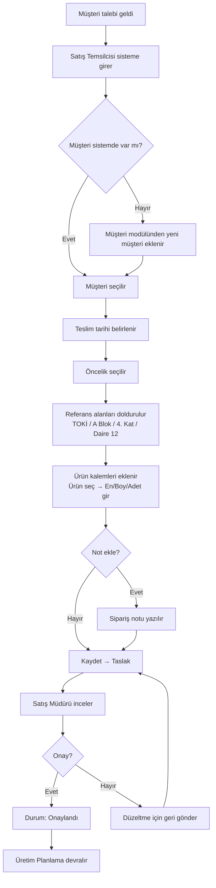
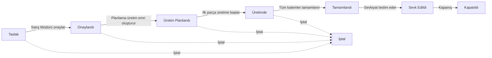
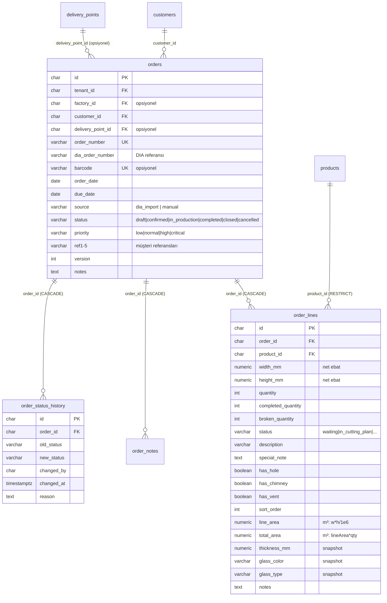
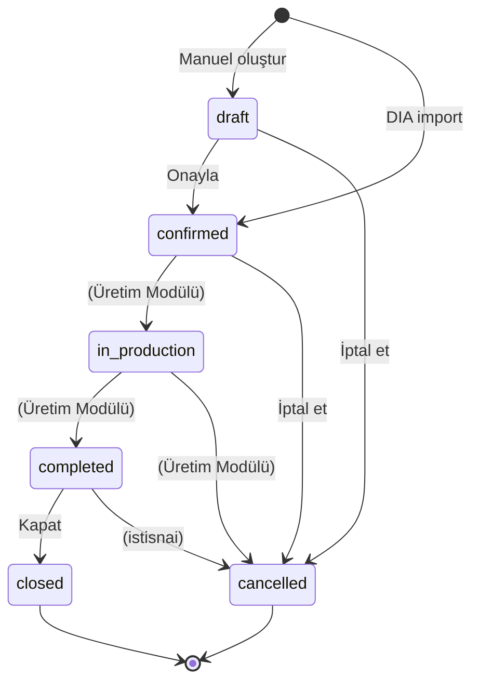

# 📋 GlassOS Sales Order Module — Mimari Tasarım Dokümanı

> **Versiyon:** 1.0 (Taslak — Onay Bekliyor)  
> **Tarih:** 2026-07-23  
> **Durum:** ⏳ Mimari Tasarım Aşaması — Henüz kod yazılmadı  
> **Sonraki Adım:** Onay sonrası `SALES_ORDER_IMPLEMENTATION.md` ile kodlamaya geçilecek

---

## İçindekiler

1. [Executive Summary](#1-executive-summary)
2. [Domain Felsefesi](#2-domain-felsefesi)
3. [Kullanıcı Persona ve Roller](#3-kullanıcı-persona-ve-roller)
4. [Ekran Mimarisi](#4-ekran-mimarisi)
5. [Kullanıcı Akış Diyagramı](#5-kullanıcı-akış-diyagramı)
6. [Sayfa Bazında Detaylı Tasarım](#6-sayfa-bazında-detaylı-tasarım)
7. [Veritabanı Tasarımı](#7-veritabanı-tasarımı)
8. [Entity İlişkileri](#8-entity-i̇lişkileri)
9. [Sipariş Yaşam Döngüsü (State Machine)](#9-sipariş-yaşam-döngüsü-state-machine)
10. [Müşteri Referans Sistemi](#10-müşteri-referans-sistemi)
11. [API Tasarımı](#11-api-tasarımı)
12. [Server Action Planı](#12-server-action-planı)
13. [Yetkilendirme Yapısı](#13-yetkilendirme-yapısı)
14. [Mevcut Sistemle Entegrasyon](#14-mevcut-sistemle-entegrasyon)
15. [Mevcut Şemadan Sapmalar (Breaking Changes)](#15-mevcut-şemadan-sapmalar-breaking-changes)
16. [Açık Sorular](#16-açık-sorular)
17. [Uygulama Planı](#17-uygulama-planı)

---

## 1. Executive Summary

GlassOS Sales Order modülü, cam temper fabrikasının **siparişten üretime** geçişindeki ilk adımdır. Bu modül:

- **Müşterinin talebini kaydeder** — Ürün, ebat, adet, teslim tarihi
- **Üretim hesaplaması yapmaz** — Trim, rodaj, fire, verim, maliyet bu modülde YOKTUR
- **Reçete seçtirmez** — Kullanıcı ürün seçer; reçete üretim planlamada belirlenir
- **Müşteri referans sistemini yönetir** — İnşaat sektörüne özel çok alanlı referans
- **Üretim emrine köprü kurar** — Bir sipariş birden fazla üretim emrine bölünebilir

### Mevcut Durum Analizi

| Katman | Durum | Bu Tasarımdaki Değişiklik |
|--------|-------|--------------------------|
| `orders` tablosu | ✅ Var | 🔄 Genişletilecek: source, priority, ref1-5, barcode, closed status |
| `order_lines` tablosu | ✅ Var | 🔄 Genişletilecek: status, description, hasHole/Chimney/Vent, lineArea, totalArea, thickness/glassColor/glassType snapshot |
| `order_notes` tablosu | ✅ Var | ⚪ Aynen kalacak |
| `order_status_history` tablosu | 🆕 Yeni | immutable audit log |
| Order API | ✅ Var (Hono) | 🔄 Genişletilecek: yeni status endpoint'leri, DIA import |
| Order Service | ✅ Var | 🔄 Genişletilecek: ref sistemi, snapshot alma |
| Order UI | ❌ `PagePlaceholder` | 🆕 Tamamen yeni yazılacak |

---

## 2. Domain Felsefesi

### 2.1. GlassOS ERP Değildir

GlassOS bir **MES (Manufacturing Execution System)** + **Production Intelligence** platformudur. Klasik ERP'lerin sipariş modülünden farklı olarak:

| Klasik ERP'de VAR | GlassOS'ta |
|-------------------|------------|
| Fiyat / Birim fiyat | ❌ Yok (ERP'den gelir) |
| İskonto / Vergi / Döviz | ❌ Yok |
| Tahsilat / Vade / Muhasebe | ❌ Yok |
| Stoktan satış / Stok rezervasyonu | ❌ Yok |
| Teslimat adresi yönetimi | ✅ Var (delivery_points üzerinden) |
| Sipariş → Üretim izlenebilirliği | ✅ Ana güçlü yön |

### 2.2. Sipariş ≠ Üretim

```
Müşteri Talebi (Sipariş)  →  Üretim Emri  →  Reçete  →  Üretim  →  Mamül
───────────────────────       ──────────      ──────     ──────     ─────
Bu ekranda yapılır           Planlamada      Otomatik   Operasyon   Stok
```

Sipariş modülü yalnızca **müşterinin ne istediğini** kaydeder. "Nasıl üretilecek" sorusu sonraki aşamaların sorumluluğundadır.

### 2.3. Ürün Odaklı, Reçete Odaklı Değil

Müşteri reçete bilmez. "8 mm Füme Temper" sipariş eder. Bu ürünün hangi reçeteyle üretileceği, sipariş onaylandıktan sonra üretim planlama aşamasında belirlenir. Aynı ürün zaman içinde farklı reçetelere sahip olabilir (verim iyileştirme, makine değişikliği vb.).

---

## 3. Kullanıcı Persona ve Roller

### 3.1. Persona Listesi

| Persona | Rol | Sorumluluk |
|---------|-----|-----------|
| **Satış Temsilcisi** | `Sales` | Sipariş oluşturur, müşteriyle iletişim kurar, referans bilgilerini girer |
| **Satış Müdürü** | `SalesManager` | Siparişleri onaylar, önceliklendirir, müşteri özel isteklerini yönetir |
| **Üretim Planlama** | `ProductionPlanner` | Onaylı siparişleri üretim emrine dönüştürür, gruplandırır, schedule eder |
| **Üretim Müdürü** | `ProductionManager` | Üretim emirlerini onaylar, iptal/erteleme kararı verir |
| **Sevkiyat Sorumlusu** | `Shipping` | Tamamlanan siparişleri sevk eder, sevk durumunu günceller |
| **Yönetici** | `Admin` | Tam yetki, konfigürasyon, silinen kayıtları görme |

### 3.2. Hangi Ekranı Kim Kullanır?

| Ekran | Satış | Satış Müd. | Üretim Plan. | Sevkiyat | Yönetici |
|-------|:-----:|:----------:|:------------:|:--------:|:--------:|
| `/orders` (liste) | ✅ Kendi | ✅ Tümü | ✅ Tümü | ✅ Sevke hazır | ✅ Tümü |
| `/orders/new` | ✅ | ✅ | ❌ | ❌ | ✅ |
| `/orders/[id]` (detay) | ✅ | ✅ | ✅ | ✅ | ✅ |
| `/orders/[id]` (onayla) | ❌ | ✅ | ❌ | ❌ | ✅ |
| `/orders/[id]` (sevk) | ❌ | ❌ | ❌ | ✅ | ✅ |

---

## 4. Ekran Mimarisi

### 4.1. Rota Yapısı

```
(dashboard)/
└── orders/
    ├── page.tsx                    → Sipariş Listesi (ana ekran)
    ├── new/
    │   └── page.tsx                → Yeni Sipariş Oluşturma
    └── [id]/
        ├── page.tsx                → Sipariş Detayı (Genel sekmesi)
        ├── items/
        │   └── page.tsx            → Sipariş Kalemleri (tab)
        ├── production/
        │   └── page.tsx            → Bağlı Üretim Emirleri (tab)
        ├── notes/
        │   └── page.tsx            → Notlar Geçmişi (tab)
        └── timeline/
            └── page.tsx            → Durum Geçmişi (tab)

customers/[id]/
└── orders/
    └── page.tsx                    → Müşteriye Ait Siparişler (customer-scoped)
```

### 4.2. Navigation

```
Sidebar
├── 🏠 Dashboard
├── 👥 Customers
├── 📦 Orders          ← YENİ (şu an PagePlaceholder)
│   ├── All Orders
│   └── New Order
├── 🏭 Production
│   ├── Workspace
│   └── Orders
├── 📋 Recipes
├── 📊 Inventory
│   ...
```

---

## 5. Kullanıcı Akış Diyagramı

### 5.1. Sipariş Oluşturma Akışı



### 5.2. Tam Yaşam Döngüsü



---

## 6. Sayfa Bazında Detaylı Tasarım

### 6.1. Sipariş Listesi (`/orders`)

**Kullanıcı:** Satış Temsilcisi, Satış Müdürü, Üretim Planlama, Sevkiyat

**Layout:** Tek panel, tam genişlik

```
┌─────────────────────────────────────────────────────────┐
│  Siparişler                          [+ Yeni Sipariş]   │
│  ─────────────────────────────────────────────────────  │
│  [🔍 Arama...]  [Status ▼]  [Tarih Aralığı]  [🔄]      │
│                                                         │
│  ┌──────┬──────┬──────┬──────┬──────┐                  │
│  │Taslak│Onaylı│Plandı│Ürtmd│Sevk  │  ← KPI Mini Bar   │
│  │  3   │  12  │  8   │  15 │  5   │                  │
│  └──────┴──────┴──────┴──────┴──────┘                  │
│                                                         │
│  ┌───────────────────────────────────────────────────┐  │
│  │ Sipariş No  │ Müşteri   │ Referans │ Tarih │ Durum│  │
│  │─────────────│───────────│──────────│───────│──────│  │
│  │ SO-2026-001 │ Öztok Yapı│ TOKİ / A │15 Tem │Taslak│  │
│  │ SO-2026-002 │ Yılmaz Cam│ M.Amca   │14 Tem │Onaylı│  │
│  │ ...                                           │  │
│  └───────────────────────────────────────────────────┘  │
│                                                         │
│  ← 1 2 3 ... 10 →                                      │
└─────────────────────────────────────────────────────────┘
```

**KPI Mini Bar Kartları:**
| Kart | Renk | İçerik |
|------|------|--------|
| Taslak | Gray | Sayı, toplam m² |
| Onaylandı | Blue | Sayı, toplam m² |
| Üretim Planlandı | Amber | Sayı, toplam m² |
| Üretimde | Purple | Sayı, toplam m² |
| Tamamlandı/Sevk | Green | Sayı, toplam m² |

**DataGrid Kolonları:**
| Kolon | Açıklama | Sıralama |
|-------|----------|:--------:|
| Sipariş No | `orderNumber` | ✅ |
| Müşteri | `customer.name` | ✅ |
| Müşteri Referansı | `ref1 / ref2 / ref3 / ref4` formatında | ❌ |
| Sipariş Tarihi | `orderDate` | ✅ |
| Teslim Tarihi | `dueDate` (gecikmiş = 🔴) | ✅ |
| Toplam m² | Tüm kalemlerin toplam alanı | ✅ |
| Durum | Badge (draft/secondary, confirmed/info, ...) | ✅ |
| Öncelik | Badge (critical/danger, high/warning, ...) | ✅ |
| İşlemler | → Detay butonu | ❌ |

**Arama:** `orderNumber`, `customer.name`, `ref1`, `ref2`, `ref3`, `ref4`, `ref5` alanlarında **full-text arama**. Kullanıcı "TOKİ" yazdığında ref1'de "TOKİ" olan tüm siparişler bulunur.

**Filtreler:**
- Status (çoklu seçim)
- Öncelik (çoklu seçim)
- Tarih aralığı (orderDate)
- Müşteri (Combobox)

---

### 6.2. Yeni Sipariş (`/orders/new`)

**Kullanıcı:** Satış Temsilcisi, Satış Müdürü

**Layout:** Üst bilgiler + Alt kalemler, tek sayfa

```
┌─────────────────────────────────────────────────────────┐
│  ← Geri    Yeni Sipariş                         [Kaydet]│
│  ─────────────────────────────────────────────────────  │
│                                                         │
│  ┌─── Sipariş Bilgileri ──────────────────────────────┐ │
│  │                                                    │ │
│  │  Sipariş No  [___________] (opsiyonel, oto-atama)  │ │
│  │  Müşteri     [🔍 Seç...           ▼]               │ │
│  │  Sipariş Trh [____-__-__]  Teslim Trh [____-__-__] │ │
│  │  Öncelik     [Normal ▼]                            │ │
│  │                                                    │ │
│  │  ┌─── Müşteri Referansı ───────────────────────┐   │ │
│  │  │ Ref 1 [_____________] Ref 2 [_____________]  │   │ │
│  │  │ Ref 3 [_____________] Ref 4 [_____________]  │   │ │
│  │  │ Ref 5 [_____________] (opsiyonel)            │   │ │
│  │  └──────────────────────────────────────────────┘   │ │
│  │                                                    │ │
│  │  Notlar  [____________________________________]     │ │
│  │                                                    │ │
│  └────────────────────────────────────────────────────┘ │
│                                                         │
│  ┌─── Sipariş Kalemleri ──────── [+ Kalem Ekle] ──────┐ │
│  │                                                     │ │
│  │  #1 ┌──────────┬──────┬──────┬──────┬──────┬─────┐ │ │
│  │     │ Ürün ▼   │ En   │ Boy  │ Adet │Brm  │ Açk │ │ │
│  │     │8mm Füme  │ 1200 │ 2000 │  15  │m²   │ ... │ │ │
│  │     │ Temper   │  mm  │  mm  │      │     │     │ │ │
│  │     └──────────┴──────┴──────┴──────┴──────┴─────┘ │ │
│  │                                                     │ │
│  │  #2 ┌──────────┬──────┬──────┬──────┬──────┬─────┐ │ │
│  │     │ Ürün ▼   │ En   │ Boy  │ Adet │Brm  │ Açk │ │ │
│  │     │6+12+6    │  800 │ 1800 │   5  │m²   │ ... │ │ │
│  │     │ Isıcam   │  mm  │  mm  │      │     │     │ │ │
│  │     └──────────┴──────┴──────┴──────┴──────┴─────┘ │ │
│  │                                                     │ │
│  └─────────────────────────────────────────────────────┘ │
│                                                         │
│  ┌─── Sipariş Özeti ──────────────────────────────────┐ │
│  │  Toplam Kalem: 2  │  Toplam Alan: 5.040 m²         │ │
│  │  Toplam Adet: 20  │                                │ │
│  └────────────────────────────────────────────────────┘ │
└─────────────────────────────────────────────────────────┘
```

**Önemli:** Bu ekranda **hiçbir üretim hesaplaması yoktur.** Trim, rodaj, fire, verim, optimizasyon — hiçbiri gösterilmez. Sadece sipariş bilgileri girilir.

**Kalem satırı:**
| Alan | Bileşen | Zorunlu | Açıklama |
|------|---------|:-------:|----------|
| Ürün | Combobox | ✅ | `products` tablosundan, aktif ürünler |
| En | Input (numeric) | ✅ | mm cinsinden, Business Dimension |
| Boy | Input (numeric) | ✅ | mm cinsinden, Business Dimension |
| Adet | Input (numeric) | ✅ | Kaç adet |
| Birim | Combobox | ✅ | m² / adet / mt / kg |
| Açıklama | Input (text) | ❌ | Kaleme özel not (örn. "rodajlı", "kuzey cephe") |

**Validation kuralları:**
- En az bir kalem zorunlu
- En/Boy > 0
- Adet > 0
- Müşteri seçili olmalı
- Müşteri aktif olmalı (operational_block kontrolü)

---

### 6.3. Sipariş Detayı (`/orders/[id]`)

**Kullanıcı:** Satış Temsilcisi, Satış Müdürü, Üretim Planlama, Sevkiyat

**Layout:** Sekmeli yapı (müşteri detayıyla aynı pattern)

```
┌─────────────────────────────────────────────────────────┐
│  ← Siparişler   SO-2026-001              [✏️] [🔄] [❌] │
│  ─────────────────────────────────────────────────────  │
│  [Genel] [Kalemler] [Üretim] [Notlar] [Geçmiş]          │
│  ─────────────────────────────────────────────────────  │
│                                                         │
│  (sekmeye göre içerik)                                  │
│                                                         │
└─────────────────────────────────────────────────────────┘
```

#### Sekme 1: Genel Bilgiler

```
┌─── Durum ───────────────────────────────────────────────┐
│  [Onaylandı]  →  [Üretim Planlandı]  →  [Üretimde]      │
│   ✅              ⏳                   ○                 │
│  12 Tem 14:30    12 Tem 16:00                           │
└─────────────────────────────────────────────────────────┘

┌─── Sipariş Bilgileri ──────────────────────────────────┐
│  Müşteri:    Öztok Yapı (OZT-001)                      │
│  Referans:   TOKİ / A Blok / 4. Kat / Daire 12         │
│  Sipariş Trh: 12.07.2026                               │
│  Teslim Trh:  20.07.2026  (7 gün kaldı)                │
│  Öncelik:    Yüksek                                     │
│  Sorumlu:    Ahmet Yılmaz (Satış)                       │
│  Oluşturan:  Ahmet Yılmaz — 12.07.2026 14:30           │
└─────────────────────────────────────────────────────────┘

┌─── Sipariş Notu ───────────────────────────────────────┐
│  "Müşteri acele istiyor, hafta sonu çalışması gerekebilir"│
└─────────────────────────────────────────────────────────┘

┌─── Özet ────────────────────────────────────────────────┐
│  Kalem: 3  │  Toplam Alan: 15.240 m²  │  Adet: 45      │
│  Tamamlanan: 0  │  Kırık: 0  │  Kalan: 45              │
└─────────────────────────────────────────────────────────┘
```

**Durum Aksiyon Butonları (bağlama göre):**

| Mevcut Durum | Görünen Buton | Yeni Durum | Yetki |
|-------------|---------------|-----------|-------|
| Taslak | Onayla | Onaylandı | SalesManager |
| Taslak | Düzenle | (form) | Sales |
| Taslak | Sil | (soft delete) | Sales |
| Onaylandı | Üretime Planla | Üretim Planlandı | ProductionPlanner |
| Onaylandı | İptal | İptal | SalesManager |
| Üretim Planlandı | Üretime Başla | Üretimde | ProductionManager |
| Üretim Planlandı | İptal | İptal | ProductionManager |
| Üretimde | İptal | İptal | ProductionManager |
| Tamamlandı | Sevk Et | Sevk Edildi | Shipping |
| Sevk Edildi | Kapat | Kapatıldı | SalesManager |

---

#### Sekme 2: Kalemler

```
┌─── Sipariş Kalemleri ──────────────────────────────────┐
│                                                        │
│  # │Ürün          │ En    │ Boy   │ Adet│Brm│Durum     │
│  ──│──────────────│───────│───────│─────│───│──────────│
│  1 │8mm Füme Temp │ 1200  │ 2000  │ 15  │m² │⏳ Ürtmde│
│  2 │8mm Füme Temp │  800  │ 1500  │ 10  │m² │✅ Tmm    │
│  3 │6+12+6 Isıcam │ 1000  │ 2200  │  5  │m² │⏳ Ürtmde│
│                                                        │
│  Tamamlanan: 10/30  Kırık: 0  (ilerleme barı)          │
│  ████████░░░░░░░░░░░░░░░░░░ 33%                        │
└─────────────────────────────────────────────────────────┘
```

Her kalem satırında **tamamlanma durumu** gösterilir: `tamamlanan / toplam` ve ilerleme barı.

---

#### Sekme 3: Bağlı Üretim Emirleri

```
┌─── Üretim Emirleri ────────────────────────────────────┐
│                                                        │
│  Üretim Emri │ Makine  │Başlama │ Durum   │ Kalemler   │
│  ────────────│─────────│────────│─────────│────────────│
│  MO-2026-045 │CNC-1    │12 Tem  │ Kesimde │ #1, #2     │
│  MO-2026-046 │Temper-2 │14 Tem  │ Bekliyor│ #1, #3     │
│                                                        │
│  [+ Yeni Üretim Emri Oluştur]                          │
│                                                        │
│  ⚠️ Kalem #2: SADECE MO-2026-045'te (1 emir)          │
│  ⚠️ Kalem #1: MO-2026-045 + MO-2026-046 (2 emir)      │
└─────────────────────────────────────────────────────────┘
```

Bu sekme, sipariş ↔ üretim emri arasındaki **çoka çok** ilişkiyi gösterir. Kullanıcı buradan:
- Mevcut üretim emirlerini ve durumlarını görebilir
- Yeni üretim emri oluşturabilir (sipariş kalemlerini seçerek)

---

#### Sekme 4: Notlar

Siparişe eklenmiş tüm notların kronolojik listesi. Her not: tarih, yazan kişi, dahili/harici etiketi.

#### Sekme 5: Geçmiş (Timeline)

```
┌─── Durum Geçmişi ──────────────────────────────────────┐
│                                                        │
│  12.07 14:30  ● Taslak — Ahmet Yılmaz oluşturdu       │
│  12.07 14:35  ● Onaylandı — Mehmet Kaya onayladı      │
│  12.07 16:00  ● Üretim Planlandı — Ayşe Demir          │
│              │    MO-2026-045 oluşturuldu              │
│  13.07 09:00  ● Üretimde — MO-2026-045 başladı        │
│              │    (CNC-1, Kesim operasyonu)            │
│                                                        │
└─────────────────────────────────────────────────────────┘
```

---

### 6.4. Müşteriye Ait Siparişler (`/customers/[id]/orders`)

**Kullanıcı:** Satış Temsilcisi, Satış Müdürü

Müşteri detayındaki sekmelerden biri olarak (mevcut tab sistemine entegre):

```
Müşteri: Öztok Yapı
[Genel] [Üretim] [İletişim] [Yetkililer] [Teslimat] [Cam Kataloğu] [Talimatlar] [SİPARİŞLER] ← YENİ
```

Bu sekme, o müşteriye ait tüm siparişleri listeler (`findByCustomer` repository metodu zaten var).

---

## 7. Veritabanı Tasarımı

### 7.1. `orders` Tablosu — Mevcut + Eklenecek Kolonlar

```sql
-- ===== MEVCUT KOLONLAR (değişmeyecek) =====
id              CHAR(26) PRIMARY KEY        -- ULID
tenant_id       CHAR(26) NOT NULL FK→tenants
factory_id      CHAR(26) FK→factories
customer_id     CHAR(26) NOT NULL FK→customers
order_number    VARCHAR(50) NOT NULL         -- unique per tenant (index ile)
order_date      DATE NOT NULL
due_date        DATE
status          VARCHAR(30) NOT NULL DEFAULT 'draft'
notes           TEXT
created_at      TIMESTAMPTZ NOT NULL DEFAULT NOW()
updated_at      TIMESTAMPTZ NOT NULL
created_by      CHAR(26)
updated_by      CHAR(26)
deleted_at      TIMESTAMPTZ
deleted_by      CHAR(26)

-- ===== YENİ KOLONLAR (bu tasarımla eklenecek) =====
source          VARCHAR(20) NOT NULL DEFAULT 'manual'
                -- dia_import | manual

dia_order_number VARCHAR(50)               -- DIA'dan gelen orijinal sipariş no

barcode         VARCHAR(100)                -- Sipariş barkodu (unique per tenant)

priority        VARCHAR(20) NOT NULL DEFAULT 'normal'
                -- low | normal | high | critical

ref1            VARCHAR(100)                -- Müşteri Referansı 1 (Proje)
ref2            VARCHAR(100)                -- Müşteri Referansı 2 (Üst Proje)
ref3            VARCHAR(100)                -- Müşteri Referansı 3 (Blok)
ref4            VARCHAR(100)                -- Müşteri Referansı 4 (Kat)
ref5            VARCHAR(100)                -- Müşteri Referansı 5 (Birim)

delivery_point_id CHAR(26) FK→delivery_points
                -- ADR-2026-07-19-02 referans alınarak eklenecek

version          INTEGER NOT NULL DEFAULT 1  -- Optimistic locking
```

### 7.2. `order_lines` Tablosu — Mevcut + Eklenecek Kolonlar

```sql
-- ===== MEVCUT KOLONLAR (değişmeyecek) =====
id              CHAR(26) PRIMARY KEY
order_id        CHAR(26) NOT NULL FK→orders (CASCADE)
product_id      CHAR(26) NOT NULL FK→products (RESTRICT)
width_mm        NUMERIC(8,2) NOT NULL       -- Business Dimension (net ebat)
height_mm       NUMERIC(8,2) NOT NULL       -- Business Dimension (net ebat)
quantity        INTEGER NOT NULL
completed_quantity INTEGER NOT NULL DEFAULT 0
broken_quantity INTEGER NOT NULL DEFAULT 0
notes           TEXT
created_at      TIMESTAMPTZ NOT NULL DEFAULT NOW()
updated_at      TIMESTAMPTZ NOT NULL

-- ===== YENİ KOLONLAR =====
status          VARCHAR(20) NOT NULL DEFAULT 'waiting'
                -- waiting | in_cutting_plan | cut | in_production | completed | cancelled

description     VARCHAR(255)                -- Kaleme özel kısa açıklama (Baca, Menfez vb.)
special_note    TEXT                        -- Kaleme özel uzun talimat

has_hole        BOOLEAN NOT NULL DEFAULT false
has_chimney     BOOLEAN NOT NULL DEFAULT false
has_vent        BOOLEAN NOT NULL DEFAULT false

sort_order      INTEGER NOT NULL DEFAULT 0  -- Kalem sıralaması

-- ===== HESAPLANMIŞ ALANLAR =====
line_area       NUMERIC(12,4)               -- m² cinsinden: width_mm * height_mm / 1_000_000
total_area      NUMERIC(12,4)               -- m² cinsinden: line_area * quantity

-- ===== ÜRÜN SNAPSHOT (değişmez kopya) =====
thickness_mm    NUMERIC(5,2)                -- Sipariş anındaki ürün kalınlığı (snapshot)
glass_color     VARCHAR(100)                -- Sipariş anındaki cam rengi (snapshot)
glass_type      VARCHAR(100)                -- Sipariş anındaki cam tipi (snapshot)
```

### 7.3. `order_notes` Tablosu — DEĞİŞİKLİK YOK

Mevcut haliyle yeterli. `noteText`, `isInternal`, `createdBy`, timing alanları ihtiyacı karşılıyor.

### 7.4. `order_status_history` Tablosu — YENİ

```sql
CREATE TABLE order_status_history (
    id              CHAR(26) PRIMARY KEY,
    order_id        CHAR(26) NOT NULL REFERENCES orders(id) ON DELETE CASCADE,
    from_status     VARCHAR(30),            -- NULL for initial creation
    to_status       VARCHAR(30) NOT NULL,
    changed_by      CHAR(26),
    changed_at      TIMESTAMPTZ NOT NULL DEFAULT NOW(),
    reason          TEXT,
    metadata        JSONB                   -- additional context (e.g. MO-ids created)
);

CREATE INDEX idx_order_status_history_order 
    ON order_status_history(order_id, changed_at DESC);
```

Bu tablo **immutable audit log** olarak çalışır. Her durum değişikliği buraya kaydedilir, hiçbir kayıt silinmez veya güncellenmez.

### 7.5. Snapshot Felsefesi

Sipariş satırı, üretim için gerekli temel bilgilerin **değişmez (immutable) kopyasını** taşır.

Ürün kartı (`products` tablosu) ileride değişse bile, sipariş oluşturulduğu andaki kritik üretim bilgileri korunmalıdır.

| Snapshot Alanı | Kaynak | Açıklama |
|----------------|--------|----------|
| `thickness_mm` | `products.thickness_mm` | Sipariş anındaki ürün kalınlığı |
| `glass_color` | `products.glass_color` | Sipariş anındaki cam rengi |
| `glass_type` | `products.glass_type` | Sipariş anındaki cam tipi (temper/lamine/ısıcam vb.) |

Bu snapshot'lar sipariş satırı oluşturulurken (veya DIA'dan import edilirken) ürün kartından okunur ve **bir daha değişmez**. Geçmiş siparişler ürün kartındaki değişikliklerden etkilenmez.

**Ne zaman alınır?**
- Manuel sipariş: Kullanıcı ürünü seçtiğinde anlık snapshot
- DIA import: CSV satırı işlenirken ürün eşleşmesi yapıldığında snapshot
- **Güncellenmez** — snapshot bir kere alınır, siparişin ömrü boyunca aynı kalır

### 7.6. Sipariş Satırı ↔ Üretim Emri İlişkisi (Gelecek)

Bir sipariş satırı ileride birden fazla üretim emrine bölünebilir (kısmi üretim, fire sonrası yeniden üretim).

Bu bağlantı için **junction table** (`order_line_production_orders`) **Üretim Modülü** tarafından oluşturulacaktır. Sipariş modülü sadece `order_lines` tablosunu sağlar, üretim emirleriyle ilişkilendirmeyi yapmaz.

### 7.7. Status Enum

```
draft | confirmed | in_production | completed | closed | cancelled
```

| Status | Açıklama |
|--------|----------|
| `draft` | Taslak — manuel sipariş henüz onaylanmamış |
| `confirmed` | Onaylandı — DIA import'da otomatik, manuelde onay sonrası |
| `in_production` | En az bir satır üretimde (üretim modülü tarafından değiştirilir) |
| `completed` | Tüm satırlar tamamlandı (üretim modülü tarafından değiştirilir) |
| `closed` | Kapatıldı — arşiv niteliğinde, artık işlem yapılamaz |
| `cancelled` | İptal edildi |

**Not:** `production_planned` ve `shipped` status'leri SİPARİŞ MODÜLÜ'ne ait değildir. Bunlar sırasıyla Kesim Planı Modülü ve Sevkiyat Modülü'nün sorumluluğundadır ve ilgili modüller tasarlanırken eklenmelidir.

**Migration stratejisi:** Mevcut `confirmed`, `in_production`, `completed` aynen kalır. `closed` yeni eklenir. `draft` ve `cancelled` zaten mevcut. ALTER TABLE gerekmez — sadece uygulama seviyesinde validasyon güncellenir.

### 7.8. İndeksler

```sql
-- Mevcut (doğrulanmalı)
CREATE UNIQUE INDEX idx_orders_number ON orders(tenant_id, order_number) WHERE deleted_at IS NULL;

-- Yeni eklenecekler
CREATE INDEX idx_orders_customer ON orders(customer_id, order_date DESC) WHERE deleted_at IS NULL;
CREATE INDEX idx_orders_status ON orders(status, order_date DESC) WHERE deleted_at IS NULL;
CREATE INDEX idx_orders_due_date ON orders(due_date) WHERE status NOT IN ('shipped', 'closed', 'cancelled');

-- Referans araması için GIN index (full-text search)
CREATE INDEX idx_orders_ref_search ON orders 
    USING GIN (to_tsvector('simple', COALESCE(ref1,'') || ' ' || COALESCE(ref2,'') || ' ' || COALESCE(ref3,'') || ' ' || COALESCE(ref4,'') || ' ' || COALESCE(ref5,'')));
```

---

## 8. Entity İlişkileri



### İlişki Kuralları

| Kural | Açıklama |
|-------|----------|
| `order_lines.product_id` | NOT NULL — Müşteri her zaman ürün seçer |
| `order_lines` → `recipe` | Sipariş modülünde TANIMLANMAZ — reçete ilişkisi Üretim Modülü'nde kurulur |
| `orders → delivery_points` | Opsiyonel — Müşterinin birden fazla teslimat noktası olabilir |
| `orders → order_lines` | CASCADE — Sipariş silinirse satırlar da silinir |
| `orders → order_status_history` | CASCADE — Sipariş silinirse geçmiş de silinir |
| Soft delete | Sadece `orders` — satırlar ve notlar CASCADE ile silinir |

---

## 9. Sipariş Yaşam Döngüsü (State Machine)

### 9.1. Durumlar ve Anlamları

| Durum | Anlamı | Sorumlu Modül |
|-------|--------|:-------------:|
| `draft` | Satış temsilcisi oluşturdu, henüz onaylanmadı | Sipariş Modülü |
| `confirmed` | Onaylandı, üretim bekliyor | Sipariş Modülü |
| `in_production` | En az bir satır üretimde | **Üretim Modülü** (gelecek) |
| `completed` | Tüm kalemlerin tüm adetleri üretildi | **Üretim Modülü** (gelecek) |
| `closed` | Kapatıldı, arşiv niteliğinde | Sipariş Modülü |
| `cancelled` | Herhangi bir aşamada iptal edildi | Sipariş Modülü |

**Sipariş modülünün yönettiği geçişler:** `draft → confirmed`, `draft → cancelled`, `confirmed → cancelled`, `completed/confirmed → closed`.

Diğer tüm geçişler (`confirmed → in_production`, `in_production → completed`) gelecekteki üretim modülü tarafından yönetilir. Sipariş modülü bu durumları sadece **gösterir**, değiştirmez.

### 9.2. Geçiş Kuralları



### 9.3. Sipariş Modülünün Yönettiği Geçişler

| Geçiş | Tetikleyici | Yetki |
|-------|------------|:-----:|
| `draft → confirmed` | Manuel (Onayla butonu) | SalesManager / Admin |
| `draft → cancelled` | Manuel (İptal butonu) | SalesManager / Admin |
| `confirmed → cancelled` | Manuel (İptal butonu) | ProductionManager / Admin |
| `completed → closed` | Manuel (Kapat butonu) | SalesManager / Admin |

### 9.4. İptal Kuralları

| İptal Anındaki Durum | Ne Olur? |
|---------------------|----------|
| `draft` | Doğrudan iptal |
| `confirmed` | Henüz üretim başlamamış, doğrudan iptal |
| `in_production` | Sipariş modülü iptal edemez — üretim modülü karar verir |
| `completed` | İstisnai durum, manuel onay gerekir |

---

## 10. Müşteri Referans Sistemi

### 10.1. Veri Modeli

5 opsiyonel `VARCHAR(100)` alan: `ref1`, `ref2`, `ref3`, `ref4`, `ref5`.

### 10.2. Görüntüleme Formatı

```
Birleştirme: ref1 / ref2 / ref3 / ref4 [/ ref5]
Boş alanlar atlanır.

Örnekler:
  "TOKİ / A Blok / 4. Kat / Daire 12"
  "Cumhuriyet Lisesi / Spor Salonu / Kuzey Cephe"
  "Mehmet Amca"
```

### 10.3. Arama Davranışı

Kullanıcı arama kutusuna "TOKİ" yazdığında:
- `ref1 LIKE '%TOKİ%' OR ref2 LIKE '%TOKİ%' OR ... OR ref5 LIKE '%TOKİ%'`
- Ayrıca `customer.name LIKE '%TOKİ%'` ve `order_number LIKE '%TOKİ%'`
- PostgreSQL GIN index ile optimize edilir

### 10.4. Nerelerde Görünür?

Referans bilgisi şu ekranlarda görünmelidir:
- ✅ Sipariş Listesi (DataGrid kolonu)
- ✅ Sipariş Detayı (header altında)
- ✅ Üretim Emirleri (bağlı sipariş referansı)
- ✅ Kesim ekranı (operatör hangi siparişi kestiğini görür)
- ✅ Rodaj/Temper/Kalite istasyonları
- ✅ Sevkiyat listesi
- ✅ Raporlar

---

## 11. API Tasarımı

### 11.1. REST Endpoint'leri

| Method | Route | Açıklama | Yetki |
|--------|-------|----------|-------|
| `GET` | `/api/v1/orders` | Sipariş listesi (arama, filtre, sayfalama) | Auth |
| `GET` | `/api/v1/orders/:id` | Sipariş detayı + kalemler + notlar | Auth |
| `POST` | `/api/v1/orders` | Yeni sipariş oluştur | Sales+ |
| `PATCH` | `/api/v1/orders/:id` | Sipariş güncelle (draft only) | Sales+ |
| `DELETE` | `/api/v1/orders/:id` | Soft delete (draft only) | Sales+ |
| `POST` | `/api/v1/orders/:id/approve` | Onayla (draft → confirmed) | SalesManager+ |
| `POST` | `/api/v1/orders/:id/close` | Kapat (completed → closed) | SalesManager+ |
| `POST` | `/api/v1/orders/:id/cancel` | İptal et (draft/confirmed → cancelled) | SalesManager+ / ProductionManager+ |
| `GET` | `/api/v1/orders/:id/status-history` | Durum geçmişi | Auth |
| `GET` | `/api/v1/customers/:id/orders` | Müşteriye ait siparişler | Auth |

### 11.2. Request/Response Örnekleri

**POST /api/v1/orders (Create):**
```json
{
  "customerId": "ULID",
  "orderNumber": "SO-2026-001",        // opsiyonel, yoksa otomatik
  "orderDate": "2026-07-23",
  "dueDate": "2026-08-05",
  "priority": "high",
  "ref1": "TOKİ",
  "ref2": "A Blok",
  "ref3": "4. Kat",
  "ref4": "Daire 12",
  "notes": "Acele, hafta sonu çalışması gerekebilir",
  "deliveryPointId": "ULID",
  "lines": [
    {
      "productId": "ULID",
      "widthMm": 1200,
      "heightMm": 2000,
      "quantity": 15,
      "description": "Kuzey cephe rodajlı",
      "hasHole": false,
      "hasChimney": false,
      "hasVent": false
    }
  ]
}
```

**GET /api/v1/orders (List with filters):**
```
?search=TOKİ
&status=confirmed,in_production
&priority=high,critical
&customerId=ULID
&dateFrom=2026-07-01
&dateTo=2026-07-31
&sortBy=dueDate
&sortOrder=asc
&page=1
&limit=20
```

### 11.3. DTO Güncellemeleri

Mevcut `order.dto.ts` aşağıdaki yeni alanları içerecek şekilde genişletilecek:
- `priority` (zod enum)
- `ref1`-`ref5` (zod string max 100)
- `deliveryPointId` (zod string nullable)
- `lines` array (create sırasında zorunlu)
- `description`, `hasHole`, `hasChimney`, `hasVent` line item alanları

---

## 12. Server Action Planı

### 12.1. Yeni Dosya: `apps/web/src/app/actions/orders.ts`

```typescript
// Sipariş Listesi
listOrdersAction(search?, status?, priority?, customerId?, dateFrom?, dateTo?, page?, limit?, sortBy?, sortOrder?)

// Tek Sipariş
getOrderAction(id: string)                           // Full aggregate: header + lines + notes
getOrderStatusHistoryAction(id: string)              // Timeline

// CRUD
createOrderAction(payload: CreateOrderInput)          // Header + lines
updateOrderAction(id: string, changes: UpdateOrderInput)
deleteOrderAction(id: string)                         // Soft delete

// Status Transitions
approveOrderAction(id: string)                        // draft → confirmed
cancelOrderAction(id: string, reason?: string)        // draft/confirmed → cancelled
closeOrderAction(id: string)                          // completed → closed

// Customer-scoped
getCustomerOrdersAction(customerId: string)
```

### 12.2. Data Fetching Stratejisi

| Action | Veri Kaynağı | Sebep |
|--------|-------------|-------|
| `listOrdersAction` | Direkt DB (`@repo/db`) | Performans, JOIN ihtiyacı |
| `getOrderAction` | Direkt DB | Aggregate okuma |
| `createOrderAction` | API (`/api/v1/orders`) | Transactional, event publishing |
| `updateOrderAction` | API | Validasyon + event |
| `approveOrderAction` | API | İş kuralı kontrolü |
| Status transitions | API | Event publishing, cross-modül etkiler |

---

## 13. Yetkilendirme Yapısı

### 13.1. Rol Bazlı Erişim

| Rol | Görüntüleme | Oluşturma | Düzenleme | Onaylama | Kapatma | İptal |
|-----|:----------:|:---------:|:---------:|:--------:|:-------:|:-----:|
| `Sales` | ✅ (kendi) | ✅ | ✅ (draft) | ❌ | ❌ | ❌ |
| `SalesManager` | ✅ (tümü) | ✅ | ✅ | ✅ | ✅ | ✅ |
| `ProductionManager` | ✅ | ❌ | ❌ | ❌ | ❌ | ✅ (confirmed) |
| `Admin` | ✅ | ✅ | ✅ | ✅ | ✅ | ✅ |

### 13.2. Tenant İzolasyonu

Tüm sorgular `tenantId` scope'unda çalışır. Repository katmanında `BaseRepository.tenantScoped: true` ile otomatik filtreleme.

### 13.3. Factory İzolasyonu

`factoryId` opsiyonel FK üzerinden. Multi-factory tenant'larda siparişler factory bazında filtrelenebilir.

---

## 14. Mevcut Sistemle Entegrasyon

### 14.1. Kullanılacak Mevcut Bileşenler

| Bileşen | Kullanım Yeri |
|---------|--------------|
| `DataGrid` (`@repo/ui`) | Sipariş listesi, kalem tablosu |
| `Badge` (`@repo/ui`) | Status, öncelik göstergeleri |
| `Button` (`@repo/ui`) | Aksiyon butonları |
| `Card`, `CardHeader`, `CardContent` | Form bölümleri, detay kartları |
| `SearchBox` (`@repo/ui`) | Arama |
| `Combobox` (`@repo/ui`) | Müşteri seçimi, ürün seçimi |
| `EmptyState` (`@repo/ui`) | Boş liste durumu |
| `Dialog` (`@repo/ui`) | Onay/iptal diyalogları |
| `Input`, `Select` | Form alanları |
| `Tabs` (`@repo/ui`) | Sipariş detayı sekmeleri |

### 14.2. Kullanılacak Mevcut Servisler

| Servis | Ne için |
|--------|---------|
| `OrderService` | Temel CRUD, validasyon, onay akışı (genişletilecek) |
| `OrderRepository` | Veritabanı sorguları (genişletilecek) |
| `OrderLineRepository` | Kalem yönetimi (genişletilecek) |
| `CustomerRepository` | Müşteri doğrulama, copy-on-write |
| `ProductionRepository` | Üretim emri bağlantısı |
| `EventPublisher` | Domain event'leri (OrderApproved, OrderCancelled, vb.) |

### 14.3. Event'ler

Mevcut event sistemi kullanılacak. Yeni eklenecek event'ler:

| Event | Tetikleyici |
|-------|------------|
| `order.created` | Yeni sipariş oluşturuldu |
| `order.approved` | Sipariş onaylandı (mevcut) |
| `order.completed` | Tüm kalemler tamamlandı (üretim modülü fırlatır) |
| `order.closed` | Kapatıldı |
| `order.cancelled` | İptal edildi (mevcut) |

---

## 15. Mevcut Şemadan Sapmalar (Breaking Changes)

### 15.1. Yeni Kolonlar (Migration Gerekli)

```sql
-- ===== ORDERS =====
ALTER TABLE orders ADD COLUMN source VARCHAR(20) NOT NULL DEFAULT 'manual';
ALTER TABLE orders ADD COLUMN dia_order_number VARCHAR(50);
ALTER TABLE orders ADD COLUMN barcode VARCHAR(100);
ALTER TABLE orders ADD COLUMN priority VARCHAR(20) NOT NULL DEFAULT 'normal';
ALTER TABLE orders ADD COLUMN ref1 VARCHAR(100);
ALTER TABLE orders ADD COLUMN ref2 VARCHAR(100);
ALTER TABLE orders ADD COLUMN ref3 VARCHAR(100);
ALTER TABLE orders ADD COLUMN ref4 VARCHAR(100);
ALTER TABLE orders ADD COLUMN ref5 VARCHAR(100);
ALTER TABLE orders ADD COLUMN delivery_point_id CHAR(26) REFERENCES delivery_points(id) ON DELETE RESTRICT;
ALTER TABLE orders ADD COLUMN version INTEGER NOT NULL DEFAULT 1;

-- ===== ORDER_LINES =====
ALTER TABLE order_lines ADD COLUMN status VARCHAR(20) NOT NULL DEFAULT 'waiting';
ALTER TABLE order_lines ADD COLUMN description VARCHAR(255);
ALTER TABLE order_lines ADD COLUMN special_note TEXT;
ALTER TABLE order_lines ADD COLUMN has_hole BOOLEAN NOT NULL DEFAULT false;
ALTER TABLE order_lines ADD COLUMN has_chimney BOOLEAN NOT NULL DEFAULT false;
ALTER TABLE order_lines ADD COLUMN has_vent BOOLEAN NOT NULL DEFAULT false;
ALTER TABLE order_lines ADD COLUMN sort_order INTEGER NOT NULL DEFAULT 0;
ALTER TABLE order_lines ADD COLUMN line_area NUMERIC(12,4);
ALTER TABLE order_lines ADD COLUMN total_area NUMERIC(12,4);
ALTER TABLE order_lines ADD COLUMN thickness_mm NUMERIC(5,2);
ALTER TABLE order_lines ADD COLUMN glass_color VARCHAR(100);
ALTER TABLE order_lines ADD COLUMN glass_type VARCHAR(100);
```

### 15.2. Yeni Tablo

```sql
CREATE TABLE order_status_history (
    id CHAR(26) PRIMARY KEY,
    order_id CHAR(26) NOT NULL REFERENCES orders(id) ON DELETE CASCADE,
    old_status VARCHAR(30),
    new_status VARCHAR(30) NOT NULL,
    changed_by CHAR(26),
    changed_at TIMESTAMPTZ NOT NULL DEFAULT NOW(),
    reason TEXT
);

CREATE INDEX idx_order_status_history_order ON order_status_history(order_id, changed_at DESC);
```

### 15.3. Status Geçişleri

Mevcut `status` VARCHAR(30) genişliği yeterli, `closed` eklenir. ALTER TABLE gerekmez. Uygulama seviyesinde validasyon güncellenecek.

### 15.4. Geriye Dönük Uyumluluk

- Mevcut siparişler yeni kolonlarda NULL/default değer alır → çalışmaya devam eder
- Mevcut API endpoint'leri yeni alanları opsiyonel olarak kabul eder
- `order_lines.status` varsayılan `waiting` — mevcut satırlar bu değeri alır

---

## 16. Açık Sorular

| # | Soru | Önerilen Cevap | Karar |
|---|------|---------------|:-----:|
| Q1 | Sipariş numarası (`orderNumber`) otomatik mi, manuel mi? | İkisi de. Boş bırakılırsa otomatik `SO-YYYY-XXX` formatında. İstenirse manuel girilebilir. | ⏳ |
| Q2 | Kısmi sevkiyat desteklenecek mi? | V1'de hayır. Sipariş tamamlanmadan sevk edilemez. | ⏳ |
| Q3 | `in_production → completed` otomatik mi olacak? | Evet. Tüm kalemlerde `completed_quantity >= quantity` olduğunda otomatik. | ⏳ |
| Q4 | İptal edilen siparişin üretilmiş parçaları ne olacak? | Hurda/remnant olarak işaretlenir, maliyet kaydı tutulur. Stok olarak geri alınmaz. | ⏳ |
| Q5 | Birden fazla teslimat noktası tek siparişte? | V1'de hayır. Sipariş başına tek delivery_point. | ⏳ |
| Q6 | Reçete ne zaman atanır? | Sipariş modülünün sorumluluğunda DEĞİLDİR. Recipe Module tasarlanırken karar verilecek. | ❌ |
| Q7 | Müşteri referans alanlarının sayısı sabit mi? | Evet, 5 alan. Az kullanan 1-2 doldurur, çok kullanan hepsini kullanır. | ⏳ |

---

## 17. Uygulama Planı

### Faz 1: Veritabanı (Migration)
1. Yeni kolonları ekle (`orders`, `order_lines`)
2. Yeni tabloları oluştur (`order_status_history`, `order_line_production_orders`)
3. İndeksleri oluştur
4. Mevcut veriyi migrate et (default değerler)

### Faz 2: Backend (Servis + API)
1. `OrderService` genişlet: yeni alanlar, copy-on-write, status geçişleri
2. `OrderRepository` genişlet: arama, filtreleme, sayfalama
3. API endpoint'leri güncelle: yeni alanlar, yeni status geçişleri
4. Event'leri bağla

### Faz 3: UI (Server Actions + Sayfalar)
1. `orders.ts` actions dosyasını oluştur
2. `/orders` (liste) sayfası
3. `/orders/new` (oluşturma) sayfası
4. `/orders/[id]` (detay) sayfası — sekmeli
5. `/customers/[id]/orders` sekmesi
6. Sidebar navigasyon güncellemesi

### Faz 4: Test + Doğrulama
1. Unit testler (service, repository)
2. API integration testleri
3. E2E: sipariş oluştur → onayla → MO'ya bağla senaryosu

---

> **⏳ Bu doküman ONAY BEKLİYOR.**
> 
> Onay sonrası `SALES_ORDER_IMPLEMENTATION.md` oluşturulacak ve kodlama başlayacaktır.
> 
> Herhangi bir noktada değişiklik talebi olursa, bu doküman güncellenip tekrar onaya sunulacaktır.
