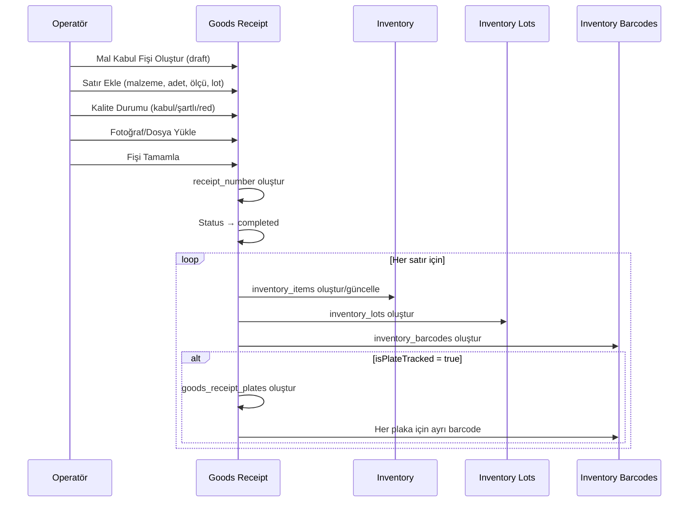

# Goods Receipt (Mal Kabul) Mimarisi

> **Versiyon:** 1.1  
> **Tarih:** 2026-07-18  
> **Durum:** ✅ Implemented — Sprint 2.10.0'da tamamlandı, Inventory entegrasyonu aktif  
> **Son Güncelleme:** 2026-07-23  

---

## 1. Amaç

Goods Receipt modülü, GlassOS ERP/MES içinde **fiziksel mal girişlerinin tek yetkili noktasıdır**. Material Master'da tanımlanan ürün kartları, ancak bir Mal Kabul işlemi sonrasında fiili stoğa dönüşür.

Bu modül, cam sektörü başta olmak üzere tüm üretim sektörlerinde kullanılabilecek **sektör bağımsız** bir mimariyle tasarlanmıştır.

---

## 2. Problem

Material Master modülü tamamlanmıştır ancak:

- Material Master **stok tutmaz** — sadece ürün kartıdır
- Stok oluşması için bir **fiili giriş işlemine** ihtiyaç vardır
- Cam sektöründe her gelen malzemenin **ebat bilgisi**, **lot numarası**, **kalite durumu** kayıt altına alınmalıdır
- Tedarikçi ile yaşanabilecek anlaşmazlıklarda **kanıt niteliğinde fotoğraf ve doküman** saklanmalıdır
- **Plaka bazlı takip** isteğe bağlı olmalıdır — gerçek fabrikalarda yüzlerce cam üst üste gelir

---

## 3. Alınan Kararlar

| # | Karar | Gerekçe |
|---|-------|---------|
| 1 | Material Master stok tutmaz. Stok Goods Receipt sonrasında oluşur. | Material Master bir ürün kartıdır; stok miktarı, lot ve lokasyon bilgisi içermez. |
| 2 | Goods Receipt, Inventory'nin tek giriş noktasıdır. | Stoğa mal girişi yalnızca Mal Kabul ile yapılır. Başka bir yoldan stok oluşamaz. |
| 3 | Plaka bazlı takip satır bazında opsiyoneldir. | Gerçek fabrikalarda tek tek plaka tanımı pratik değildir. Varsayılan: toplu giriş. |
| 4 | Araç ve evrak bilgileri header'da isteğe bağlıdır. | Her teslimatta araç/evrak bilgisi girilmeyebilir. Zorunlu olmamalıdır. |
| 5 | Fotoğraf ve dosya ekleri header veya item'a bağlanabilir. | Tüm sevkiyatın fotoğrafı header'a, hasarlı malzemenin fotoğrafı item'a bağlanır. |
| 6 | Şartlı kabul ve reddedilen malzeme desteklenir. | Gerçek fabrika sürecinde malzemenin bir kısmı şartlı kabul edilebilir, bir kısmı reddedilebilir. |
| 7 | Purchasing modülü henüz yoktur — Goods Receipt bağımsız çalışır. | Purchasing yazılana kadar Goods Receipt bekletilemez. `purchase_order_id` forward reference olarak eklenir. |
| 8 | Sistem sektör bağımsızdır. Cam'a özel alanlar opsiyonel ve genişletilebilirdir. | İleride kimya, gıda, metal gibi sektörlerde de kullanılabilmelidir. |

---

## 4. Veri Modeli

### 4.1. Aggregate: `goods_receipts` (Header)

```typescript
interface GoodsReceipt {
  // Core Identity
  id: string;                    // ULID
  tenantId: string;              // FK → tenants
  factoryId: string;             // FK → factories
  receiptNumber: string;         // GR-{YYYY}-{FACTORY}-{SEQ}
  receiptDate: string;           // ISO date
  receiptTime: string;           // HH:mm (vardiya takibi)

  // Delivery
  supplierId: string | null;     // FK → suppliers (forward ref)
  purchaseOrderId: string | null;// FK → purchase_orders (forward ref)
  warehouseId: string;           // FK → warehouses
  receivedById: string;          // FK → personnel

  // Vehicle (Optional)
  vehiclePlate: string | null;
  trailerPlate: string | null;
  driverName: string | null;
  driverPhone: string | null;
  carrierCompany: string | null;

  // Documents (Optional)
  despatchNumber: string | null;
  despatchDate: string | null;
  invoiceNumber: string | null;
  orderReference: string | null;

  // Status
  status: "draft" | "completed" | "cancelled";
  notes: string | null;

  // Audit
  createdAt: string;
  updatedAt: string;
  createdBy: string | null;
  updatedBy: string | null;
  deletedAt: string | null;
  deletedBy: string | null;
}
```

### 4.2. Aggregate Detail: `goods_receipt_items`

```typescript
interface GoodsReceiptItem {
  id: string;                    // ULID
  goodsReceiptId: string;        // FK → goods_receipts (cascade)
  lineNo: number;

  // Material & Dimensions
  materialId: string;            // FK → materials_master
  formatId: string | null;       // FK → glass_formats (forward ref)
  widthMm: number | null;
  heightMm: number | null;

  // Quantity & Cost
  quantity: number;
  unit: string;
  lotNumber: string | null;      // Supplier lot
  internalLotNumber: string;     // System lot: LOT-{YYYYMM}-{SEQ}
  unitCost: number | null;
  currency: string | null;

  // Warehouse Override
  targetWarehouseId: string | null; // FK → warehouses

  // Quality
  qualityStatus: "accepted" | "conditional" | "rejected";
  qualityNotes: string | null;

  // Plate Tracking
  isPlateTracked: boolean;       // default: false
}
```

### 4.3. Sub-Entity: `goods_receipt_attachments`

```typescript
interface GoodsReceiptAttachment {
  id: string;
  goodsReceiptId: string;        // FK → goods_receipts (cascade)
  goodsReceiptItemId: string | null; // FK → goods_receipt_items (set null)

  fileName: string;
  fileType: "image" | "pdf" | "document";
  fileUrl: string;
  mimeType: string;
  fileSizeBytes: number;

  category:
    | "irsiye"
    | "fatura"
    | "quality_cert"
    | "ce_cert"
    | "photo_truck"
    | "photo_package"
    | "photo_damage"
    | "photo_despatch"
    | "other";

  description: string | null;
}
```

### 4.4. Sub-Entity: `goods_receipt_plates` (Opsiyonel — Sadece isPlateTracked = true)

```typescript
interface GoodsReceiptPlate {
  id: string;
  goodsReceiptItemId: string;    // FK → goods_receipt_items (cascade)
  plateSerial: string;           // GR-{RECEIPT_NO}-{LINE}-{SEQ}
  widthMm: number;
  heightMm: number;
  thicknessMm: number | null;
  barcodeId: string | null;      // FK → inventory_barcodes (set null)
}
```

### 4.5. Enum: `glass_formats` (Ebat Master Data)

```typescript
interface GlassFormat {
  id: string;                    // ULID
  tenantId: string;              // FK → tenants
  formatCode: string;            // e.g. "JUMBO-6000x3210"
  name: string;
  formatType: "jumbo" | "machine" | "special";
  widthMm: number;
  heightMm: number;
  isActive: boolean;
}
```

---

## 5. Veri Akışı



---

## 6. İlişkili Modüller

| Modül | İlişki Tipi | Açıklama |
|-------|------------|----------|
| **Material Master** | 1:N | `goods_receipt_items.material_id` → `materials_master.id` |
| **Inventory** | 1:1 | Mal kabul sonrası stok oluşur. Aynı transaction içinde. |
| **Purchasing** | 0:1 (forward) | `goods_receipts.purchase_order_id` → future `purchase_orders.id` |
| **Warehouse** | N:1 | `goods_receipts.warehouse_id` → `warehouses.id` |
| **Personnel** | N:1 | `goods_receipts.received_by` → `personnel.id` |
| **Factory Config** | referans | Plaka takip varsayılanı, dosya boyut limitleri |
| **Supplier Performance** | gelecek | Reddedilen malzeme oranı → tedarikçi skoru |
| **Traceability** | gelecek | Plaka bazlı takip → seri numarası → üretim takibi |
| **Quality Control** | gelecek | Şartlı kabul → kalite sürecine yönlendirme |

---

## 7. Plaka Bazlı Takip Mimarisi

### Varsayılan Davranış

```
isPlateTracked = false (varsayılan)
    → inventory_barcodes: TEK kayıt (tüm adetler toplu)
    → Örnek: "25 adet 6000x3210 Şeffaf Float 4mm"
    → goods_receipt_plates: oluşmaz
```

### Plaka Bazlı Davranış

```
isPlateTracked = true
    → goods_receipt_plates: 25 ayrı kayıt
      - JMB000001: 6000x3210, LOT-202607-00012
      - JMB000002: 6000x3210, LOT-202607-00012
      - ...
    → inventory_barcodes: 25 ayrı kayıt
    → Her plaka kendi seri numarasıyla takip edilir
```

### Global Ayar (Factory Configuration)

```json
{
  "config_key": "receiving.default_plate_tracking",
  "config_value": "false",
  "config_type": "receiving"
}
```

Operatör her satırda bu varsayılanı override edebilir.

---

## 8. Inventory ile Transactional Bütünlük

Goods Receipt tamamlama işlemi, Inventory güncellemesi ile **aynı transaction** içinde yapılmalıdır:

```
BEGIN TRANSACTION
  UPDATE goods_receipts SET status = 'completed';
  INSERT INTO inventory_items (...) VALUES (...);
  INSERT INTO inventory_lots (...) VALUES (...);
  INSERT INTO inventory_barcodes (...) VALUES (...);
  -- IF plate tracked:
  INSERT INTO goods_receipt_plates (...) VALUES (...);
COMMIT
```

**Kural:** Yarım kalmış Mal Kabul = stok oluşmaz. Transactional bütünlük sağlanamazsa tüm işlem geri alınır.

---

## 9. Gelecekteki Genişleme Planları

| Özellik | Planlanan Sprint | Açıklama |
|---------|-----------------|----------|
| Purchasing Entegrasyonu | Sprint 3.x | `purchaseOrderId` aktif FK olur. PO'suz giriş engellenebilir (ops). |
| Supplier Performance | Sprint 3.x | Reddedilen malzeme oranı, zamanında teslimat skoru |
| Traceability (Tam) | Sprint 3.x | Plaka → Üretim Siparişi → Müşteri zinciri |
| RFID Destek | Gelecek | `goods_receipt_plates`'e rfid_code alanı eklenir |
| Mobil Mal Kabul | Gelecek | Saha terminali/tablet ile fotoğraf + barkod okutma |
| Tartı Entegrasyonu | Gelecek | Köprü tartısından otomatik miktar çekme |
| ASN (Advanced Ship Notice) | Gelecek | Tedarikçinin ön bildirimi ile mal kabul hazırlığı |

---

## 10. Uygulama Planı

### Aşama 1 — Temel CRUD
1. `glass_formats` tablosu (enum master data)
2. `goods_receipts` tablosu (header)
3. `goods_receipt_items` tablosu (detail)
4. `goods_receipt_attachments` tablosu (dosyalar)
5. Temel CRUD server actions + UI

### Aşama 2 — Inventory Entegrasyonu ✅ (Sprint 2.10.0)
1. `goods_receipt_plates` tablosu (opsiyonel plaka takibi)
2. ✅ Mal kabul tamamlama → Inventory oluşturma (transactional) — `completeGoodsReceiptAction` içinde implemente edildi
   - `inventory_items` var olan kartı bulur, yoksa `materials_master` bilgisiyle otomatik oluşturur
   - Her satır için `inventory_lots` oluşturur (lot no, miktar, birim fiyat, kalite durumu)
   - Rejected kalemler atlanır, damaged/missing hesaplanarak efektif miktar girilir
   - Aynı transaction içinde status → completed ve audit log yazılır
3. ✅ `inventory_items.material_id` → `materials_master` FK migration'ı yapıldı
4. ✅ Drizzle şeması güncellendi

### Aşama 3 — Kalite ve Purchasing
1. Kalite kontrol akışı (şartlı kabul → kalite süreci)
2. Purchasing modülü ile entegrasyon
3. Supplier Performance hesaplamaları

---

## 11. Document History

| Tarih | Versiyon | Değişiklik |
|-------|----------|------------|
| 2026-07-18 | 1.0 | İlk sürüm — Mimari tasarım ve veri modeli |
| 2026-07-23 | 1.1 | Inventory entegrasyonu implementasyon notu: FK düzeltmesi, completeGoodsReceiptAction inventory oluşturma |
