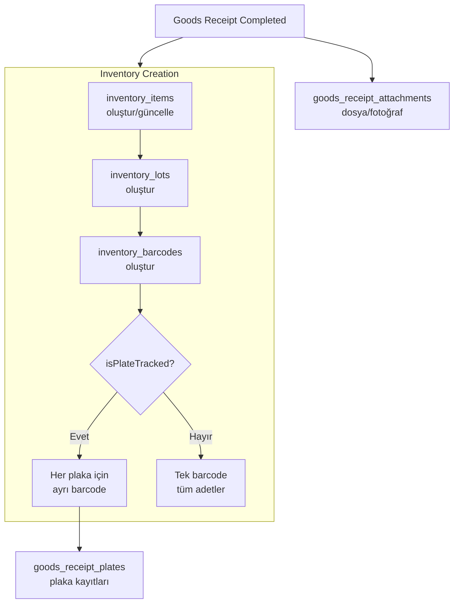

# Inventory Flow (Stok Veri Akışı)

> **Versiyon:** 1.1  
> **Tarih:** 2026-07-23  
> **Durum:** ✅ Implemented — Inventory modülü canlıda çalışıyor, Goods Receipt entegrasyonu tamamlandı  

---

## 1. Amaç

Goods Receipt modülünün Inventory ile veri akışını tanımlar. Mal kabul sonrasında fiziksel stok verilerinin hangi sırayla, hangi tablolara ve hangi kurallarla yazılacağını belirler.

---

## 2. Problem (Çözüldü)

Inventory yapısı (`inventory_items`, `inventory_lots`, `inventory_barcodes`) eski `materials` tablosuna bağlıydı ve Goods Receipt ile Inventory arasında bağlantı yoktu. **Sprint 2.10.0 kapsamında çözülmüştür:**
- ✅ `inventory_items.material_id` FK'sı `materials_master.id`'ye yönlendirildi
- ✅ `completeGoodsReceiptAction` artık Inventory kayıtlarını otomatik oluşturuyor

---

## 3. Alınan Kararlar

| # | Karar | Gerekçe |
|---|-------|---------|
| 1 | Inventory girişi yalnızca Goods Receipt üzerinden yapılır. | Stokta tutarsızlığı önlemek için tek giriş noktası. |
| 2 | Goods Receipt tamamlama ile Inventory oluşturma aynı transaction'dadır. | Yarım kalmış işlem stoğu bozmamalıdır. |
| 3 | Inventory Items Lot bazlıdır. Her Goods Receipt satırı bir Lot oluşturur. | FIFO/LIFO/ortalama maliyet hesaplaması için lot zorunludur. |
| 4 | Plaka bazlı takipte her plaka ayrı barcode alır. | opsiyonel — fabrika ayarına bağlı. |
| 5 | `inventory_items.material_id` → `materials_master.id` olarak güncellenmiştir. | FK migration yapıldı, Drizzle şeması güncellendi. `inventory_barcodes.material_id` ilerleyen sprintte ele alınacak. |

---

## 4. Veri Akış Diyagramı



---

## 5. Tablo Bazında Veri Akışı

### 5.1. inventory_items

**Kaynak:** Her `goods_receipt_items` satırı, 1 `inventory_items` kaydı oluşturur.

```typescript
// Yeni kayıt
{
  id: generateULID(),
  tenantId: receipt.tenantId,
  factoryId: receipt.factoryId,
  inventoryCode: `INV-${categoryCode}-${seq}`,  // NUMBERING_ARCHITECTURE.md
  name: material.name,                           // materials_master.name
  inventoryType: material.materialType,            // raw_material → raw_material (doğrudan)
  unit: item.unit,
  materialId: item.materialId,                   // → materials_master.id ✅
  locationId: item.targetWarehouseId ?? receipt.warehouseId,
  quantity: item.quantity,
  isActive: true,
}
```

**Material Type → Inventory Type Mapping:**
```typescript
const MATERIAL_TO_INVENTORY_TYPE = {
  raw_material: "RAW_MATERIAL",
  semi_finished: "SEMI_FINISHED",
  finished_good: "FINISHED_PRODUCT",
  consumable: "CONSUMABLE",
  spare_part: "SPARE_PART",
  packaging: "PACKAGING",
  // chemical, service, other → RAW_MATERIAL
};
```

### 5.2. inventory_lots

**Kaynak:** Her `goods_receipt_items` satırı, 1 `inventory_lots` kaydı oluşturur.

```typescript
{
  id: generateULID(),
  tenantId: receipt.tenantId,
  factoryId: receipt.factoryId,
  inventoryItemId: createdInventoryItem.id,     // FK → inventory_items
  lotNumber: item.internalLotNumber,             // LOT-{YYYYMM}-{SEQ}
  supplierLot: item.lotNumber,                   // Tedarikçi lot
  quantity: item.quantity,
  remainingQuantity: item.quantity,              // Tüketim azalttıkça güncellenir
  unitCost: item.unitCost,                       // Immutable — satın alma maliyeti
  currency: item.currency ?? "TRY",
  receivedAt: receipt.receiptDate,
  status: "active",
}
```

### 5.3. inventory_barcodes

**Varsayılan (isPlateTracked = false):** Tek barcode kaydı.

```typescript
{
  id: generateULID(),
  tenantId: receipt.tenantId,
  factoryId: receipt.factoryId,
  inventoryItemId: createdInventoryItem.id,
  lotId: createdLot.id,
  materialId: item.materialId,                  // → materials_master.id
  barcode: `BC-${lotNum}-001`,
  quantity: item.quantity,                       // Toplam adet
  widthMm: item.widthMm,
  heightMm: item.heightMm,
}
```

**Plaka Bazlı (isPlateTracked = true):** Her plaka için ayrı kayıt.

```typescript
// Her plaka için döngü
{
  id: generateULID(),
  ... // aynı
  barcode: `BC-${lotNum}-${plateSeq}`,
  quantity: 1,                                   // Her plaka = 1 adet
  plateSerial: plate.plateSerial,                // goods_receipt_plates.plateSerial
  widthMm: plate.widthMm,
  heightMm: plate.heightMm,
}
```

---

## 6. Transactional Akış (Pseudo-code)

```typescript
async function completeGoodsReceipt(receiptId: string) {
  return await db.transaction(async (tx) => {
    // 1. Fişi yükle ve doğrula
    const receipt = await tx.query.goods_receipts.findFirst({
      where: eq(goods_receipts.id, receiptId),
      with: { items: true },
    });

    if (!receipt || receipt.status !== "draft") {
      throw new Error("Invalid receipt status");
    }

    // 2. Her satır için inventory oluştur
    for (const item of receipt.items) {
      // 2a. Inventory Item
      const invItem = await tx.insert(inventory_items).values({
        id: generateULID(),
        tenantId: receipt.tenantId,
        factoryId: receipt.factoryId,
        inventoryCode: generateInventoryCode(),  // NUMBERING_ARCHITECTURE
        materialId: item.materialId,
        quantity: item.quantity,
        unit: item.unit,
        locationId: item.targetWarehouseId ?? receipt.warehouseId,
      }).returning();

      // 2b. Inventory Lot
      const lot = await tx.insert(inventory_lots).values({
        id: generateULID(),
        inventoryItemId: invItem[0].id,
        lotNumber: item.internalLotNumber,
        quantity: item.quantity,
        remainingQuantity: item.quantity,
        unitCost: item.unitCost,
      }).returning();

      // 2c. Inventory Barcode
      if (item.isPlateTracked) {
        // Plaka bazlı — her plaka için ayrı barcode
        const plates = await tx.query.goods_receipt_plates.findMany({
          where: eq(goods_receipt_plates.goodsReceiptItemId, item.id),
        });
        for (const plate of plates) {
          const barcode = await tx.insert(inventory_barcodes).values({
            id: generateULID(),
            inventoryItemId: invItem[0].id,
            lotId: lot[0].id,
            materialId: item.materialId,
            barcode: `BC-${lot[0].lotNumber}-${plate.plateSerial.split("-").pop()}`,
            quantity: 1,
            widthMm: plate.widthMm,
            heightMm: plate.heightMm,
          }).returning();

          // Plaka kaydını güncelle
          await tx.update(goods_receipt_plates)
            .set({ barcodeId: barcode[0].id })
            .where(eq(goods_receipt_plates.id, plate.id));
        }
      } else {
        // Toplu — tek barcode
        await tx.insert(inventory_barcodes).values({
          id: generateULID(),
          inventoryItemId: invItem[0].id,
          lotId: lot[0].id,
          materialId: item.materialId,
          barcode: `BC-${lot[0].lotNumber}-001`,
          quantity: item.quantity,
          widthMm: item.widthMm,
          heightMm: item.heightMm,
        });
      }
    }

    // 3. Fiş durumunu güncelle
    await tx.update(goods_receipts)
      .set({ status: "completed", updatedAt: new Date() })
      .where(eq(goods_receipts.id, receiptId));

    return { success: true };
  });
}
```

---

## 7. Kritik Bağımlılıklar

| # | Bağımlılık | Durum | Aksiyon |
|---|-----------|-------|---------|
| 1 | `inventory_items.material_id` → `materials_master.id` | ✅ Düzeltildi | FK migration yapıldı, eski `materials` bağı koptu |
| 2 | `inventory_barcodes.material_id` → `materials_master.id` | ⏳ Eski `materials.id`'ye bağlı — plaka takibi aktifleşince güncellenecek | Plaka takibi implementasyonunda ele alınacak |
| 3 | Supplier tablosu | ❌ Yok | Forward reference (char(26)) |
| 4 | `glass_formats` tablosu | ❌ Yok | Yeni tablo oluşturulmalı |
| 5 | Numaralandırma (`GR-`, `INV-`, `LOT-`, `BC-`) | ⚠️ Kısmen var | `GR-` prefix'i NUMBERING_ARCHITECTURE.md'ye eklenmeli |

---

## 8. Hata Senaryoları

| Senaryo | Davranış |
|---------|----------|
| Mal kabul tamamlanırken DB hatası | Transaction rollback → stok oluşmaz → fiş draft kalır |
| Aynı lot iki kere girilir | Uyarı verilir (duplicate lot_number check) |
| Malzeme `stockTracking = false` | Inventory oluşturulmaz — sadece kayıt düşülür |
| Malzeme `qualityInspectionRequired = true` | Kalite kontrol tamamlanmadan stok oluşmaz |
| Plaka sayısı ile adet uyuşmaz | Validation hatası — `plates.length !== quantity` |

---

## 9. Gelecekteki Genişleme Planları

- **Lot Consolidation:** Aynı malzemenin birden çok lotunu tek lot altında birleştirme
- **Inventory Transfer:** Goods Receipt sonrası depo transferi
- **FIFO/LIFO Engine:** Lot bazında maliyet hesaplama
- **Reservation Engine:** Sipariş bazında lot rezervasyonu
- **RFID Integration:** Barkod yerine RFID okuyucu desteği
- **Tartı Entegrasyonu:** Otomatik miktar belirleme

---

## 10. Document History

| Tarih | Versiyon | Değişiklik |
|-------|----------|------------|
| 2026-07-18 | 1.0 | İlk sürüm |
