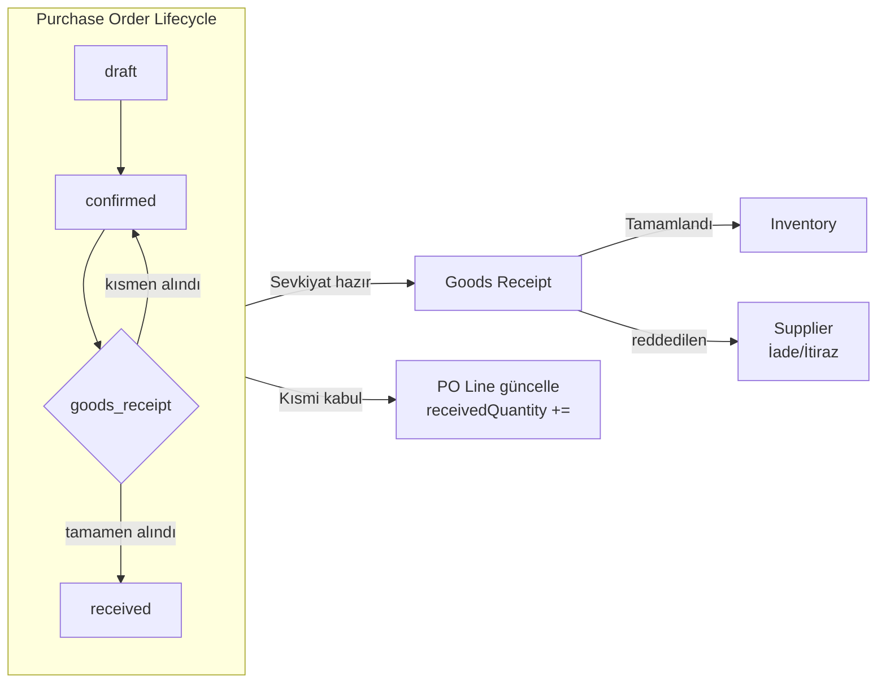

# Purchasing Flow (Satın Alma Veri Akışı)

> **Versiyon:** 1.0  
> **Tarih:** 2026-07-18  
> **Durum:** Gelecek Planı — Henüz uygulanmadı  

---

## 1. Amaç

GlassOS ERP/MES için Satın Alma (Purchasing) modülünün veri akışını ve Goods Receipt ile ilişkisini tanımlar. Bu doküman, Purchasing modülü hayata geçene kadar referans olarak kullanılacaktır.

---

## 2. Problem

GlassOS'ta **Satın Alma modülü bulunmamaktadır**. Mevcut `orders` tablosu yalnızca **müşteri siparişleri** içindir (sales orders). Tedarikçiden malzeme satın alımı için henüz bir yapı yoktur.

Goods Receipt, Purchasing'den bağımsız çalışacak şekilde tasarlanmıştır ancak ileride entegre olması gerekir.

---

## 3. Alınan Kararlar

| # | Karar | Gerekçe |
|---|-------|---------|
| 1 | Purchasing modülü ayrı bir sprintte geliştirilecektir. | Mevcut öncelik Goods Receipt + Inventory entegrasyonudur. |
| 2 | Goods Receipt, Purchasing'den bağımsız çalışabilir. | Purchasing yazılana kadar mal kabul işlemi durmamalıdır. |
| 3 | `goods_receipts.purchaseOrderId` forward reference (plain char(26)) olarak eklenir. | Purchasing tablosu oluşturulunca FK aktifleştirilir. |
| 4 | Satın alma siparişi olmadan da mal kabul yapılabilir. | Acil alımlar, direkt tedarikçi sevkiyatı desteklenmelidir. |

---

## 4. Gelecekteki Veri Modeli

### 4.1. `purchase_orders` (Header)

```typescript
interface PurchaseOrder {
  id: string;                    // ULID
  tenantId: string;              // FK → tenants
  factoryId: string;             // FK → factories
  orderNumber: string;           // PO-{YYYY}-{FACTORY}-{SEQ}
  orderDate: string;
  expectedDate: string | null;
  supplierId: string;            // FK → suppliers
  warehouseId: string;           // FK → warehouses (varsayılan depo)
  status: "draft" | "confirmed" | "received" | "cancelled";
  notes: string | null;
  createdBy: string | null;
  updatedBy: string | null;
  createdAt: string;
  updatedAt: string;
  deletedAt: string | null;
}
```

### 4.2. `purchase_order_lines`

```typescript
interface PurchaseOrderLine {
  id: string;
  purchaseOrderId: string;       // FK → purchase_orders (cascade)
  lineNo: number;
  materialId: string;            // FK → materials_master
  formatId: string | null;       // FK → glass_formats (forward ref)
  widthMm: number | null;
  heightMm: number | null;
  quantity: number;
  unit: string;
  unitPrice: number;
  currency: string;
  expectedDate: string | null;
  receivedQuantity: number;      // Mal kabul ilerledikçe güncellenir
  status: "pending" | "partial" | "received" | "cancelled";
  notes: string | null;
}
```

---

## 5. Purchasing → Goods Receipt → Inventory Akışı



---

## 6. Goods Receipt ile Entegrasyon Kuralları

### 6.1. PO Bağlantılı Mal Kabul

```
goods_receipts.purchaseOrderId = purchase_order.id
    → PO satırları yüklenir
    → Operatör gelen miktarı girer
    → PO satırındaki receivedQuantity güncellenir
    → Tüm satırlar alındıysa PO status → 'received'
```

### 6.2. PO'suz (Ad-Hoc) Mal Kabul

```
goods_receipts.purchaseOrderId = null
    → Doğrudan malzeme + miktar girişi
    → Tedarikçi adı manuel girilir
    → İleride PO oluşturulup bağlanabilir
```

### 6.3. Kısmi Kabul

```
Bir PO'nun 10 adetinin 7'si geldi:
    → goods_receipt_items.quantity = 7
    → purchase_order_lines.receivedQuantity = 7
    → purchase_order_lines.status = 'partial'
    → Kalan 3 adet için yeni bir mal kabul daha yapılabilir
```

### 6.4. Fazla Teslimat

```
Bir PO'nun 10 adetinin 12'si geldi:
    → Uyarı gösterilir
    → Kabul edilebilir tolerans Factory Configuration'da tanımlanır
    → Fazla miktar ayrı satır olarak işlenir (PO'suz)
```

---

## 7. Supplier (Tedarikçi) Tablosu

Purchasing modülü için bir `suppliers` tablosu gereklidir. Goods Receipt'te forward reference olarak kullanılır.

```typescript
interface Supplier {
  id: string;                    // ULID
  tenantId: string;              // FK → tenants
  supplierCode: string;          // Tedarikçi kodu
  name: string;                  // Firma adı
  taxId: string | null;          // Vergi no
  taxOffice: string | null;      // Vergi dairesi
  phone: string | null;
  email: string | null;
  address: string | null;
  country: string | null;
  paymentTerms: string | null;   // Ödeme koşulları
  currency: string | null;       // Varsayılan para birimi
  leadTimeDays: number | null;   // Teslim süresi
  isActive: boolean;
  // ...
}
```

---

## 8. Tedarikçi Performans Metrikleri (Gelecek)

Supplier Performance modülü, Goods Receipt verilerini kullanarak aşağıdaki metrikleri hesaplar:

| Metrik | Kaynak | Formül |
|--------|--------|--------|
| Zamanında Teslimat Oranı | `goods_receipts.receiptDate` vs `purchase_order_lines.expectedDate` | Zamanında gelen satır / Toplam satır |
| Reddedilen Malzeme Oranı | `goods_receipt_items.qualityStatus = 'rejected'` | Reddedilen satır / Toplam satır |
| Şartlı Kabul Oranı | `goods_receipt_items.qualityStatus = 'conditional'` | Şartlı kabul / Toplam satır |
| Eksik Teslimat Oranı | `goods_receipt_items.quantity` vs `purchase_order_lines.quantity` | (Sipariş - Gelen) / Sipariş |
| Kalite Skoru | Tüm kalite verileri | Ağırlıklı ortalama |

---

## 9. İlişkili Modüller

| Modül | İlişki | Açıklama |
|-------|--------|----------|
| **Goods Receipt** | Doğrudan | Satın alma siparişi → Mal kabul |
| **Inventory** | Dolaylı | Purchasing → Goods Receipt → Inventory |
| **Material Master** | Doğrudan | PO satırları materials_master'a bağlanır |
| **Supplier** | Doğrudan | Tedarikçi master data |
| **Factory Config** | Dolaylı | Fazla teslimat toleransı, varsayılan depo |
| **Finance (Gelecek)** | Gelecek | Satın alma maliyeti, borçlandırma |

---

## 10. Uygulama Sırası

1. **Supplier tablosu** — Temel tedarikçi yönetimi
2. **Purchase Orders** — Temel CRUD
3. **Purchase Order Lines** — Satır bazlı yönetim
4. **Goods Receipt Entegrasyonu** — PO → GR bağlantısı
5. **Supplier Performance** — Metrik hesaplamaları

---

## 11. Document History

| Tarih | Versiyon | Değişiklik |
|-------|----------|------------|
| 2026-07-18 | 1.0 | İlk sürüm — Gelecek planı |
