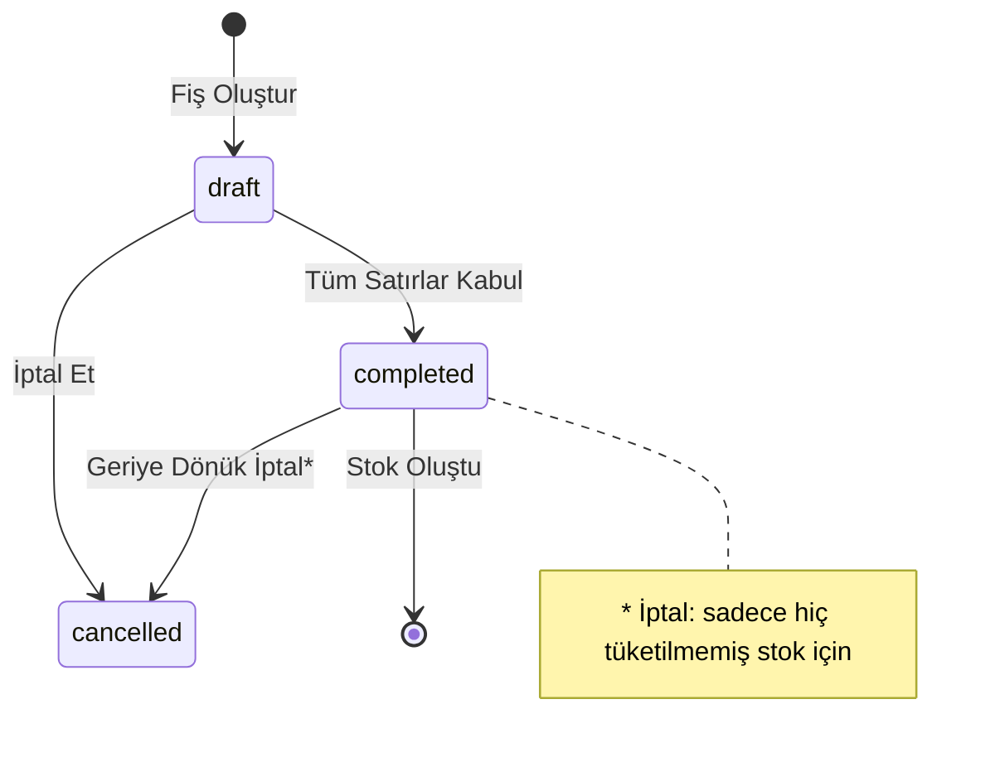

# Goods Receipt — İş Kuralları (Business Rules)

> **Versiyon:** 1.0  
> **Tarih:** 2026-07-18  
> **Durum:** ✅ Implemented — Sprint 2.10.0'da tamamlandı  

---

## 1. Amaç

Goods Receipt modülünün iş kurallarını tanımlar. Hangi durumda hangi aksiyonun alınacağını, hangi validasyonların yapılacağını belirler.

---

## 2. Temel Kurallar

### 2.1. Malzeme Doğrulama

- `goods_receipt_items.materialId` → `materials_master.id` **var olmalıdır**
- Malzemenin `isActive = true` olmalıdır
- `stockTracking = false` olan malzemeler için Inventory oluşturulmaz (sadece kayıt düşülür)

### 2.2. Miktar Doğrulama

- `quantity > 0` olmalıdır
- `unit` geçerli bir birim olmalıdır (`MATERIAL_UNITS` enum'ından)
- Plaka bazlı takipte `goods_receipt_plates.length === quantity` olmalıdır

### 2.3. Birim Tutarlılığı

- Malzemenin `baseUnit`'i ile giriş birimi uyumlu olmalıdır (veya dönüşüm faktörü tanımlanmış olmalıdır)
- Gelecekte `material_unit_profiles` tablosu ile dönüşüm desteği eklenecektir

### 2.4. Lot Numarası

- Her satır için `internalLotNumber` otomatik oluşturulur: `LOT-{YYYYMM}-{SEQ}`
- Tedarikçi lot numarası (`lotNumber`) isteğe bağlıdır ancak girilirse benzersizlik kontrolü yapılmalıdır

---

## 3. Durum Makinesi



### 3.1. draft → completed

**Koşullar:**
- En az 1 satır olmalıdır
- Her satırda `materialId`, `quantity`, `unit` zorunludur
- Her satırda `qualityStatus` belirtilmelidir
- `qualityStatus = 'rejected'` ise `qualityNotes` zorunludur
- `qualityStatus = 'conditional'` ise `qualityNotes` zorunludur
- `isPlateTracked = true` ise `goods_receipt_plates` kayıtları oluşturulmuş olmalıdır

### 3.2. completed → cancelled

**Koşullar:**
- Sadece hiç tüketilmemiş stok için geçerlidir
- Inventory'de `remainingQuantity = quantity` olan lotlar geri alınabilir
- Kısmen tüketilmiş lotlar iptal edilemez
- İptal işlemi Inventory'yi tersine günceller (stok düşümü)

---

## 4. Kalite Kontrol Kuralları

### 4.1. Kalite Durumları

| Durum | Açıklama | Stok Etkisi | Fotoğraf | Açıklama |
|-------|----------|-------------|----------|----------|
| `accepted` | Malzeme sorunsuz | Normal stok girişi | İsteğe bağlı | İsteğe bağlı |
| `conditional` | Küçük kusurlu — şartlı kabul | Normal stok girişi + uyarı | Önerilir | **Zorunlu** |
| `rejected` | Malzeme kabul edilemez | Stok oluşmaz — iade/ittraf | Önerilir | **Zorunlu** |

### 4.2. Şartlı Kabul Süreci

```
conditional → qualityNotes (zorunlu)
    → Fotoğraf yüklenir (önerilen)
    → Stok oluşur (quality_status = 'conditional')
    → Supplier Performance: kalite skorunu düşürür
    → Gelecek: Kalite sürecine otomatik yönlendirme
```

### 4.3. Red Süreci

```
rejected → qualityNotes (zorunlu)
    → Fotoğraf yüklenir (önerilen)
    → Stok oluşmaz
    → Tedarikçiye iade süreci başlatılır (manuel)
    → Supplier Performance: red oranını etkiler
    → Gelecek: Otomatik iade talimatı oluşturma
```

---

## 5. Plaka Bazlı Takip Kuralları

### 5.1. Varsayılan

- `isPlateTracked = false` (factory configuration ile override edilebilir)
- Tüm adetler tek barcode altında toplanır
- `goods_receipt_plates` oluşturulmaz

### 5.2. Aktif

- `isPlateTracked = true` (satır bazında)
- Her plaka için:
  - `plateSerial` otomatik oluşturulur: `GR-{RECEIPT_NO}-{LINE}-{SEQ}`
  - Ayrı `inventory_barcodes` kaydı oluşturulur
  - `goods_receipt_plates` kaydı oluşturulur

### 5.3. Kısmi Plaka Takibi

Aynı fişte bazı satırlar plaka bazlı, bazı satırlar toplu olabilir. Bu tamamen desteklenir — `isPlateTracked` satır bazında bir flag'dir.

---

## 6. Dosya ve Fotoğraf Kuralları

### 6.1. Dosya Tipleri

| Kategori | Açıklama | Header/Item |
|----------|----------|-------------|
| `irsiye` | İrsaliye PDF | Header |
| `fatura` | Fatura PDF | Header |
| `quality_cert` | Kalite belgesi | Header/Item |
| `ce_cert` | CE belgesi | Header |
| `photo_truck` | Tır fotoğrafı | Header |
| `photo_package` | Paket fotoğrafı | Header/Item |
| `photo_damage` | Hasarlı malzeme fotoğrafı | Item |
| `photo_despatch` | İrsaliye fotoğrafı | Header |
| `other` | Diğer | Header/Item |

### 6.2. Dosya Boyut Limitleri

- Maksimum dosya boyutu: Factory Configuration'da tanımlanır (varsayılan: 10MB)
- Desteklenen formatlar: PDF, JPEG, PNG, TIFF
- Fotoğraf çözünürlük önerisi: minimum 1920x1080

### 6.3. Depolama Stratejisi

- Dosyalar doğrudan DB'de saklanmaz
- R2/S3/Object Storage kullanılır
- DB'de sadece metadata ve URL tutulur
- File naming: `{tenant_id}/{receipt_id}/{category}_{timestamp}.{ext}`

---

## 7. Envanter Yansıma Kuralları

### 7.1. Normal Akış

```
Receipt completed → Inventory oluşur (aynı transaction)
    inventory_items.quantity += item.quantity
    inventory_lots.quantity = item.quantity
    inventory_lots.remaining_quantity = item.quantity
```

### 7.2. Daha Önce Stok Var mı?

```
materialId + warehouseId = aynı material-inventory var mı?
    → Evet: inventory_items.quantity += new_quantity
    → Hayır: yeni inventory_items kaydı
```

### 7.3. Soft Delete / İptal

```
Receipt cancelled (hiç tüketilmemiş lot)
    → inventory_lots.status = 'cancelled'
    → inventory_items.quantity -= lot.quantity
    → inventory_barcodes.status = 'cancelled'
```

---

## 8. Validation Kuralları (Zod)

### 8.1. createGoodsReceiptSchema

```typescript
const createGoodsReceiptSchema = z.object({
  // Core
  receiptDate: z.string().min(1, "Receipt date is required"),
  receiptTime: z.string().regex(/^\d{2}:\d{2}$/, "Invalid time (HH:mm)"),
  warehouseId: z.string().length(26),
  receivedById: z.string().length(26),

  // Optional Vehicle
  vehiclePlate: optionalString(),
  trailerPlate: optionalString(),
  driverName: optionalString(),
  driverPhone: optionalString(),
  carrierCompany: optionalString(),

  // Optional Documents
  despatchNumber: optionalString(),
  despatchDate: optionalString(),
  invoiceNumber: optionalString(),
  orderReference: optionalString(),

  // Status
  notes: optionalString(),

  // Items (minimum 1)
  items: z.array(createGoodsReceiptItemSchema).min(1),
});
```

### 8.2. createGoodsReceiptItemSchema

```typescript
const createGoodsReceiptItemSchema = z.object({
  materialId: z.string().length(26),
  formatId: optionalUlid("Format"),
  widthMm: optionalNumeric(),
  heightMm: optionalNumeric(),
  quantity: z.number().positive("Quantity must be positive"),
  unit: z.enum(MATERIAL_UNITS),
  lotNumber: optionalString(),
  unitCost: optionalNumeric(),
  currency: optionalString(),
  targetWarehouseId: optionalUlid("Target warehouse"),
  qualityStatus: z.enum(["accepted", "conditional", "rejected"]),
  qualityNotes: optionalString(),  // conditional/rejected'de zorunlu (app layer)
  isPlateTracked: z.boolean().default(false),
});
```

---

## 9. İstisna Durumları

| Durum | Davranış |
|-------|----------|
| Malzeme `isActive = false` | Uyarı + devam etme seçeneği |
| Malzeme `stockTracking = false` | Stok oluşturulmaz, sadece kayıt |
| Tedarikçi eşleşmezse | Uyarı, yine de devam edilebilir |
| Lot numarası daha önce kullanılmışsa | Uyarı, onay iste |
| Plaka sayısı ≠ adet | Hata — kaydedilmez |
| Dosya boyutu limit aşımı | Hata — dosya yüklenmez |

---

## 10. Document History

| Tarih | Versiyon | Değişiklik |
|-------|----------|------------|
| 2026-07-18 | 1.0 | İlk sürüm |
